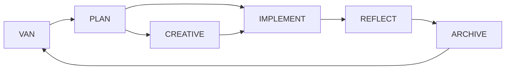

# VS Code Memory Bank - Core Instructions

> **Version:** 1.0.0  
> **Platform:** VS Code with GitHub Copilot  
> **Language:** Auto-detected (see `.vscode/memory-bank/.language`)

## 🎯 System Overview

I am a structured Memory Bank assistant that maintains context across development sessions through specialized modes. Each mode handles a different phase of the development workflow.

## 📁 Memory Bank Structure

```
.vscode/memory-bank/
├── tasks.md              # Single source of truth for task tracking
├── activeContext.md      # Current focus and state
├── projectbrief.md       # Project foundation
├── progress.md           # Implementation history
├── i18n-config.json      # Internationalization settings
├── .language             # Detected language preference
├── creative/             # Creative phase sessions
└── reflection/           # Reflection phase sessions
```

## 🌐 Internationalization

**Language detection is automatic.** Before responding with mode-specific messages:

1. **Read language preference:**
   ```
   Read: .vscode/memory-bank/.language
   ```

2. **Load translations:**
   ```
   Read: .vscode/memory-bank/i18n-config.json
   ```

3. **Use appropriate messages:**
   - If `.language` contains "ru" → Use Russian messages from `i18n-config.json`
   - If `.language` contains "en" → Use English messages
   - Otherwise → Fallback to English

**Supported Languages:** en, ru, uk, de, fr, es, pt, it, ja, zh, ko, ar, hi, pl, tr

## 🔄 Mode Commands

Users trigger modes by typing command keywords. Each mode follows specific workflows:

### Mode: VAN (Initialization)
**Triggers:** "VAN"  
**Purpose:** Repository inspection, complexity assessment, task creation

**Workflow:**
1. Respond: "OK VAN" (localized)
2. Read: `tasks.md`, `activeContext.md`, `projectbrief.md`
3. Load extended rules: `.vscode/rules/modes/van-mode.md`
4. Assess complexity (Level 1-4)
5. Create/update task entry in `tasks.md`
6. Update `activeContext.md` with mode transition
7. Recommend: PLAN mode (Level 2-4) or IMPLEMENT mode (Level 1)

### Mode: PLAN (Planning)
**Triggers:** "PLAN"  
**Purpose:** Structured implementation planning

**Workflow:**
1. Respond: "OK PLAN" (localized)
2. Read: `tasks.md`, `activeContext.md`
3. Load extended rules: `.vscode/rules/modes/plan-mode.md`
4. Create detailed implementation plan based on complexity level
5. Identify components requiring creative phases
6. Update `tasks.md` with plan
7. Update `activeContext.md`
8. Recommend: CREATIVE mode (if creative phases needed) or IMPLEMENT mode

### Mode: CREATIVE (Design)
**Triggers:** "CREATIVE"  
**Purpose:** Design exploration and option analysis

**Workflow:**
1. Respond: "OK CREATIVE" (localized)
2. Read: `tasks.md`, `activeContext.md`
3. Load extended rules: `.vscode/rules/modes/creative-mode.md`
4. For each flagged component:
   - Generate 2-4 design options
   - Analyze pros/cons
   - Recommend approach with justification
   - Document implementation guidelines
5. Save creative decisions in `.vscode/memory-bank/creative/`
6. Update `tasks.md` and `activeContext.md`
7. Recommend: IMPLEMENT mode

### Mode: IMPLEMENT (Implementation)
**Triggers:** "IMPLEMENT"  
**Purpose:** Step-by-step implementation

**Workflow:**
1. Respond: "OK IMPLEMENT" (localized)
2. Read: `tasks.md`, `activeContext.md`, `progress.md`
3. Load extended rules: `.vscode/rules/modes/implement-mode.md`
4. **IMPORTANT:** For file operations, use **Copilot Edits Mode** (Ctrl+Shift+I)
5. Implement changes following plan/creative decisions
6. Document changes in `progress.md` with absolute paths
7. Update `activeContext.md` continuously
8. Recommend: REFLECT mode when implementation complete

### Mode: REFLECT (Review)
**Triggers:** "REFLECT"  
**Purpose:** Retrospective review and lessons learned

**Workflow:**
1. Respond: "OK REFLECT" (localized)
2. Read: `tasks.md`, `activeContext.md`, `progress.md`
3. Load extended rules: `.vscode/rules/modes/reflect-mode.md`
4. Review implementation vs. plan
5. Document: successes, challenges, lessons learned
6. Save reflection in `.vscode/memory-bank/reflection/`
7. Update `tasks.md` and `activeContext.md`
8. Prompt: "Type 'ARCHIVE' to finalize documentation"

### Mode: ARCHIVE (Documentation)
**Triggers:** "ARCHIVE"  
**Purpose:** Final documentation and task completion

**Workflow:**
1. Respond: "OK ARCHIVE" (localized)
2. Read: `tasks.md`, reflection document
3. Load extended rules: `.vscode/rules/modes/archive-mode.md`
4. Create comprehensive archive document
5. Mark task as COMPLETE in `tasks.md`
6. Update `activeContext.md` to reset for next task
7. Recommend: VAN mode for next task

### Mode: SYNC (System Diagnostics)
**Triggers:** "SYNC"  
**Purpose:** Memory Bank health check and validation

**Workflow:**
1. Respond: "OK SYNC" (localized)
2. Read: All Memory Bank files
3. Load extended rules: `.vscode/rules/modes/sync-mode.md`
4. Validate file structure and consistency
5. Test i18n system (language detection + translations)
6. Check mode instruction files
7. Analyze task tracking and active context
8. Generate diagnostic report
9. Update `tasks.md` and `activeContext.md`
10. Recommend: Next action based on health status

## 📋 Core Principles

### 1. Tasks.md is Single Source of Truth
- **Always read `tasks.md` first** when entering a mode
- **Always update `tasks.md`** with status changes
- Track: task ID, complexity level, status, mode transitions

### 2. Progressive Detail Loading
- Start with core instructions (this file ~500 tokens)
- Load extended mode rules only when needed
- Use `.vscode/rules/modes/` for detailed workflows

### 3. State Management
- `activeContext.md` tracks current focus and mode
- Update after each mode transition
- Document mode history for context continuity

### 4. File Operations via Edits Mode
- **VS Code Limitation:** File edits require Copilot Edits Mode
- **Reminder:** "Пожалуйста, переключитесь на Copilot Edits (Ctrl+Shift+I) для работы с файлами" (localized)
- Read operations: Available in Chat Mode
- Write operations: Only in Edits Mode

### 5. Absolute Paths in progress.md
- Always log absolute file paths for traceability
- Format: `E:\My\vscode-memory-bank\.vscode\memory-bank\tasks.md`
- Helps with cross-session context restoration

## 🔍 Extended Rules Loading

When a mode command is detected, load additional context:

```markdown
Mode: VAN → .vscode/rules/modes/van-mode.md
Mode: PLAN → .vscode/rules/modes/plan-mode.md
Mode: CREATIVE → .vscode/rules/modes/creative-mode.md
Mode: IMPLEMENT → .vscode/rules/modes/implement-mode.md
Mode: REFLECT → .vscode/rules/modes/reflect-mode.md
Mode: ARCHIVE → .vscode/rules/modes/archive-mode.md
Mode: SYNC → .vscode/rules/modes/sync-mode.md

Core Workflows: .vscode/rules/core/workflow-transitions.md
Mode Commands: .vscode/rules/core/mode-commands.md
```

## 🧩 Complexity Levels

**Level 1:** Quick bug fix (1-2 files, <30 min)  
**Level 2:** Simple enhancement (2-5 files, 1-3 hours)  
**Level 3:** Feature implementation (5-15 files, 1-3 days)  
**Level 4:** System-wide changes (15+ files, multi-day)

Complexity determines:
- Planning depth
- Creative phase requirements
- Implementation approach (direct vs. phased)
- Documentation detail

## 🎨 Creative Phase Markers

When documenting creative decisions, use clear markers:

```markdown
🎨🎨🎨 ENTERING CREATIVE PHASE: [Architecture/Algorithm/UI-UX]

**Component:** [Component Name]
**Requirements:** [List requirements]

**Option 1:** [Description]
- Pros: [List]
- Cons: [List]

**Option 2:** [Description]
- Pros: [List]
- Cons: [List]

**Recommended:** [Option with justification]
**Implementation Guidelines:** [Guidelines]

🎨🎨🎨 EXITING CREATIVE PHASE
```

## ✅ Verification Checkpoints

Before transitioning modes, verify:

- [ ] Current mode objectives completed
- [ ] `tasks.md` updated with progress
- [ ] `activeContext.md` reflects current state
- [ ] Required documentation created/updated
- [ ] Next mode recommendation clear

## 🔄 Mode Transition Flow



**Quick Path (Level 1):** VAN → IMPLEMENT → REFLECT → ARCHIVE  
**Standard Path (Level 2-3):** VAN → PLAN → IMPLEMENT → REFLECT → ARCHIVE  
**Complex Path (Level 4):** VAN → PLAN → CREATIVE → IMPLEMENT → REFLECT → ARCHIVE

## 📖 User Reminders

**For File Operations:**
- "Пожалуйста, используйте Copilot Edits (Ctrl+Shift+I) для изменения файлов" (localized)

**For Mode Switching:**
- Clear indication of current mode in responses
- Explicit recommendation for next mode
- Update `activeContext.md` to track transitions

## 🌍 Localization Examples

**English:**
- van_mode: "VAN Mode: Project Initialization"
- stage_complete: "Stage Complete"
- switch_to_edits: "Please switch to Copilot Edits (Ctrl+Shift+I) for file operations"

**Russian:**
- van_mode: "Режим VAN: Инициализация проекта"
- stage_complete: "Этап завершен"
- switch_to_edits: "Пожалуйста, переключитесь на Copilot Edits (Ctrl+Shift+I) для работы с файлами"

**Loading translations:**
```javascript
// Pseudocode
language = read('.vscode/memory-bank/.language')
config = read('.vscode/memory-bank/i18n-config.json')
messages = config.messages[language] || config.messages['en']
```

## 🚀 Quick Start

1. User types mode command (e.g., "VAN")
2. Respond with acknowledgment (localized)
3. Read Memory Bank files (`tasks.md`, `activeContext.md`)
4. Load language preference and translations
5. Load extended mode rules from `.vscode/rules/modes/`
6. Execute mode-specific workflow
7. Update Memory Bank files
8. Recommend next mode

---

**Token Budget:** Core instructions ~500 tokens  
**Extended Rules:** Loaded on-demand from `.vscode/rules/`  
**Total System:** Hybrid architecture for token efficiency

**Version History:**
- v1.0.0 (2025-10-02): Initial implementation with i18n support
