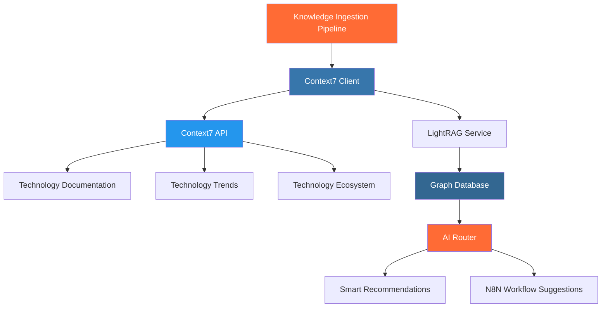

# Context7 Integration Guide

## 🎯 **Обзор интеграции**

[Context7](https://context7.com/) - это современный MCP Server от Upstash, который предоставляет структурированную документацию и контекст для различных технологий. Мы интегрировали Context7 в нашу систему Knowledge Ingestion Pipeline для автоматического получения актуальной информации о современных технологиях.

## 🏗️ **Архитектура интеграции**



## 🚀 **Возможности интеграции**

### **1. Автоматическое обнаружение новых технологий**
- Получение трендов технологий из Context7
- Автоматическое создание TechnologyEntity для новых технологий
- Интеграция с существующей граф-базой знаний

### **2. Обогащение существующих технологий**
- Поиск документации в Context7
- Получение экосистемы технологии (связанные технологии, use cases)
- Обновление n8n интеграций на основе актуальных данных

### **3. Синхронизация знаний**
- Периодическая синхронизация с Context7
- Обновление популярности и трендов
- Добавление новых документов в граф

## 📋 **Поддерживаемые технологии**

### **Frontend Technologies**
- React, Next.js, Vue.js, Angular, Svelte
- TypeScript, JavaScript
- Tailwind CSS, Bootstrap, Material-UI, Chakra UI

### **Backend Technologies**
- Node.js, Express, FastAPI, Django, Flask
- Python, Rust, Go
- PostgreSQL, MongoDB, Redis, MySQL

### **DevOps & Infrastructure**
- Docker, Kubernetes
- AWS, Azure, Google Cloud Platform
- GitHub Actions, GitLab CI, Jenkins

### **API & Communication**
- GraphQL, REST, WebSocket, gRPC
- JWT, OAuth

### **Testing & Quality**
- Jest, Cypress, Playwright, Vitest

### **Build Tools**
- Webpack, Vite, Rollup, esbuild

## 🛠️ **Использование**

### **CLI команды**

```bash
# Синхронизация с Context7
python scripts/manage_knowledge.py sync-context7

# Обогащение конкретной технологии
python scripts/manage_knowledge.py enrich react

# Поиск технологий (теперь с данными Context7)
python scripts/manage_knowledge.py search "React TypeScript" --limit 10

# Получение рекомендаций (обогащенных Context7)
python scripts/manage_knowledge.py recommend --technologies "React" "Node.js" --architecture "fullstack"
```

### **Автоматическая инициализация**

```bash
# Запуск полной инициализации с Context7
.\scripts\init-knowledge-base.ps1
```

## 🔧 **Конфигурация**

### **Настройка Context7 Client**

```python
# В src/knowledge/context7_client.py
class Context7Client:
    def __init__(self, settings: Settings):
        self.base_url = "https://context7.com"
        self.api_url = f"{self.base_url}/api/v1"
        
        # Популярные технологии для поиска
        self.popular_technologies = [
            "react", "nextjs", "vue", "angular", "svelte",
            "nodejs", "express", "fastapi", "django", "flask",
            # ... и другие
        ]
        
        # Маппинг технологий на n8n интеграции
        self.technology_n8n_mapping = {
            "react": ["HTTP Request", "Webhook", "Code"],
            "fastapi": ["HTTP Request", "Webhook", "REST API"],
            # ... и другие
        }
```

## 📊 **Структура данных Context7**

### **Context7Document**
```python
@dataclass
class Context7Document:
    title: str
    url: str
    content: str
    category: str  # getting-started, api, integration, examples
    technology: str
    tags: List[str]
    last_updated: Optional[datetime]
```

### **Context7SearchResult**
```python
@dataclass
class Context7SearchResult:
    documents: List[Context7Document]
    total_count: int
    query: str
    search_time: float
```

## 🔄 **Процесс синхронизации**

### **1. Получение трендов**
```python
trends = await self.context7_client.get_technology_trends()
# Возвращает список трендовых технологий с метриками
```

### **2. Обогащение технологий**
```python
for trend in trends:
    # Поиск документации
    search_result = await self.context7_client.search_technology(tech_name)
    
    # Получение экосистемы
    ecosystem = await self.context7_client.get_technology_ecosystem(tech_name)
    
    # Обновление в граф-базе
    await self._update_technology_with_ecosystem(tech_name, ecosystem)
```

### **3. Добавление документов**
```python
for doc in search_result.documents:
    await self._add_context7_document_to_graph(doc)
```

## 📈 **Метрики и мониторинг**

### **Результаты синхронизации**
```python
sync_results = {
    "technologies_processed": 15,
    "documents_added": 45,
    "technologies_enriched": 12,
    "new_technologies_discovered": 3,
    "errors": []
}
```

### **Логирование**
```python
logger.info("Context7 sync completed", 
           technologies_processed=15,
           documents_added=45,
           technologies_enriched=12)
```

## 🎯 **Преимущества интеграции**

### **1. Актуальность данных**
- Автоматическое получение последней документации
- Отслеживание трендов технологий
- Обновление популярности и рейтингов

### **2. Богатый контекст**
- Структурированная документация
- Примеры использования
- Лучшие практики

### **3. Умные рекомендации**
- Контекстные предложения технологий
- Релевантные n8n workflow'ы
- Оценка сложности и временных затрат

### **4. Автоматизация**
- Периодическая синхронизация
- Автоматическое обнаружение новых технологий
- Обновление существующих знаний

## 🔮 **Планы развития**

### **Краткосрочные (1-2 недели)**
- [ ] Реальная интеграция с Context7 API
- [ ] Аутентификация и API ключи
- [ ] Обработка ошибок и retry логика

### **Среднесрочные (1-2 месяца)**
- [ ] Кэширование результатов поиска
- [ ] Инкрементальная синхронизация
- [ ] Метрики использования

### **Долгосрочные (3+ месяца)**
- [ ] Интеграция с другими источниками (GitHub, Stack Overflow)
- [ ] ML модели для предсказания трендов
- [ ] Персонализированные рекомендации

## 🚨 **Ограничения и известные проблемы**

### **Текущие ограничения**
- Симуляция API (пока нет реального доступа к Context7 API)
- Ограниченный набор технологий
- Нет кэширования результатов

### **Планируемые исправления**
- Интеграция с реальным Context7 API
- Расширение списка поддерживаемых технологий
- Добавление кэширования и оптимизации

## 📚 **Дополнительные ресурсы**

- [Context7 Official Website](https://context7.com/)
- [Upstash Documentation](https://docs.upstash.com/)
- [MCP Server Specification](https://spec.modelcontextprotocol.io/)

## 🤝 **Участие в разработке**

Для улучшения интеграции с Context7:

1. **Добавление новых технологий**: Обновите `popular_technologies` в `Context7Client`
2. **Улучшение маппинга**: Расширьте `technology_n8n_mapping`
3. **Оптимизация поиска**: Улучшите `_build_search_query`
4. **Добавление метрик**: Расширьте логирование и мониторинг

---

**Context7 интеграция превращает нашу систему в мощный инструмент для работы с современными технологиями, обеспечивая актуальность и богатство контекста для всех рекомендаций и предложений!** 🎉
