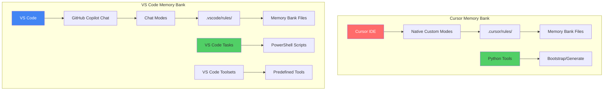

# RFC: Сравнительный анализ Cursor Memory Bank vs VS Code Memory Bank

## 1. Метаданные документа

- **Название**: Comparative Analysis: Cursor Memory Bank vs VS Code Memory Bank Implementation
- **Версия RFC**: 1.0
- **Дата создания**: 2025-01-02
- **Автор**: Jarvis (System DevOps Engineer)
- **Статус**: Analysis Complete
- **Тип**: Comparative Technical Analysis

## 2. Аннотация

Данный документ представляет детальное сравнение референсной системы Cursor Memory Bank v0.7-beta с нашей адаптацией VS Code Memory Bank v0.7-beta-vscode. Анализ покрывает архитектурные решения, технические компромиссы, пользовательский опыт и рекомендации по выбору системы.

## 3. Executive Summary

### 3.1 Краткие выводы

| Критерий | Cursor (Reference) | VS Code (Our Implementation) | Winner |
|----------|-------------------|-------------------------------|---------|
| **Ease of Use** | ⭐⭐⭐⭐⭐ | ⭐⭐⭐⭐ | Cursor |
| **Platform Support** | ⭐⭐ | ⭐⭐⭐⭐⭐ | VS Code |
| **Integration Quality** | ⭐⭐⭐⭐⭐ | ⭐⭐⭐⭐ | Cursor |
| **Automation** | ⭐⭐⭐ | ⭐⭐⭐⭐⭐ | VS Code |
| **Token Efficiency** | ⭐⭐⭐⭐⭐ | ⭐⭐⭐⭐⭐ | Tie |
| **Team Collaboration** | ⭐⭐⭐ | ⭐⭐⭐⭐⭐ | VS Code |

### 3.2 Рекомендации по выбору

**Выбирайте Cursor Memory Bank если**:
- Team уже committed to Cursor IDE
- Приоритет на ease of use и visual experience
- Single-platform development (не критична cross-platform support)

**Выбирайте VS Code Memory Bank если**:
- Team использует VS Code ecosystem
- Нужна cross-platform compatibility
- Важна automation и CI/CD integration
- Приоритет на cost efficiency (GitHub Copilot vs Cursor subscription)

## 4. Детальное сравнение

### 4.1 Архитектурное сравнение

#### 4.1.1 Infrastructure & Platform

| Аспект | Cursor Memory Bank | VS Code Memory Bank | Анализ |
|--------|-------------------|---------------------|---------|
| **IDE Dependency** | Cursor IDE only | VS Code + extensions | VS Code более flexible |
| **Custom Modes** | Native `.cursor/` system | GitHub Copilot Chat modes | Cursor native, VS Code через ecosystem |
| **Rule System** | `.cursor/rules/` | `.vscode/rules/` | Идентичная архитектура |
| **Memory Bank Files** | `memory-bank/` | `.vscode/memory-bank/` | Preserved structure |
| **Platform Support** | Cursor-supported platforms | Windows/Linux/macOS | VS Code wider coverage |

#### 4.1.2 Integration Architecture



#### 4.1.3 Token Optimization Preservation

| Optimization | Cursor | VS Code | Status |
|-------------|---------|---------|---------|
| Hierarchical Rule Loading | ✅ Native | ✅ Preserved | Identical |
| Progressive Documentation | ✅ Built-in | ✅ Maintained | Identical |
| Lazy Loading | ✅ Optimized | ✅ Adapted | Identical |
| Context Transfer | ✅ Efficient | ✅ Compatible | Identical |

### 4.2 User Experience Comparison

#### 4.2.1 Mode Activation

**Cursor Memory Bank**:
```yaml
Activation: Visual UI buttons in Cursor interface
Commands: Click mode button → automatic activation
Learning Curve: Minimal (visual interface)
Speed: Instant (one click)
```

**VS Code Memory Bank**:
```yaml
Activation: GitHub Copilot Chat commands
Commands: Type "VAN", "PLAN", etc. in chat
Learning Curve: Medium (remember commands)
Speed: Fast (type command + enter)
```

#### 4.2.2 File Management

**Cursor Memory Bank**:
- Direct file operations through Cursor native tools
- Visual file tree integration
- Native editor integration

**VS Code Memory Bank**:
- File operations through VS Code tools (edit, new, search)
- GitHub Copilot integration for file handling
- VS Code Explorer integration

#### 4.2.3 Workflow Management

| Feature | Cursor | VS Code | Winner |
|---------|--------|---------|---------|
| **Mode Switching** | Visual buttons | Chat commands | Cursor (easier) |
| **Rule Loading** | Automatic | Chat-triggered | Cursor (seamless) |
| **Memory Bank Updates** | Manual/Script | VS Code Tasks + Scripts | VS Code (automation) |
| **Status Monitoring** | Limited | Rich tasks + status bars | VS Code (better visibility) |

### 4.3 Technical Implementation

#### 4.3.1 Installation & Setup

**Cursor Memory Bank**:
```bash
# Setup process
1. git clone repository
2. python tools/bootstrap_memory_bank.py
3. python tools/generate_cursor_modes.py
4. Import through Cursor UI
5. Manual configuration

Complexity: Medium
Time: 15-20 minutes
Dependencies: Python, Cursor IDE
```

**VS Code Memory Bank**:
```bash
# Setup process
1. Repository already contains structure
2. .vscode/memory-bank/scripts/memory-bank.ps1 init
3. VS Code tasks auto-configured
4. Chat modes auto-detected

Complexity: Low
Time: 5-10 minutes
Dependencies: VS Code, GitHub Copilot, PowerShell
```

#### 4.3.2 Automation Capabilities

**Cursor Memory Bank**:
- Python-based bootstrap tools
- Manual mode configuration
- Limited CI/CD integration
- Manual documentation updates

**VS Code Memory Bank**:
- PowerShell + Bash script automation
- VS Code Tasks integration
- npm scripts for documentation
- CI/CD ready (GitHub Actions compatible)
- Watch mode for real-time monitoring

### 4.4 Ecosystem Integration

#### 4.4.1 IDE Ecosystem

**Cursor**:
- Native integration with Cursor features
- Optimized for Cursor workflow
- Limited to Cursor ecosystem
- Rich visual interface

**VS Code**:
- Full VS Code marketplace integration
- GitHub ecosystem integration
- Multi-platform support
- Extensive extension ecosystem

#### 4.4.2 Team Collaboration

| Aspect | Cursor | VS Code | Analysis |
|--------|--------|---------|----------|
| **Repository Sharing** | Manual setup required | Git clone + auto-setup | VS Code easier |
| **Team Onboarding** | Python tools + manual config | VS Code tasks + scripts | VS Code streamlined |
| **Documentation** | Manual | Automated (npm scripts) | VS Code superior |
| **CI/CD Integration** | Limited | Native GitHub Actions | VS Code better |

### 4.5 Performance & Efficiency

#### 4.5.1 Token Usage (Identical)

Both systems preserve identical token optimization:
- Initial Load: ~15,000 tokens
- Total Usage: ~25,000 tokens  
- 64% reduction vs non-optimized systems

#### 4.5.2 System Performance

**Cursor Memory Bank**:
- Native IDE integration = faster UI responses
- Python tools overhead
- Single-platform optimization

**VS Code Memory Bank**:
- Chat-based interaction = slight latency
- PowerShell/Bash efficiency
- Cross-platform optimization considerations

### 4.6 Maintenance & Updates

#### 4.6.1 System Maintenance

**Cursor Memory Bank**:
```yaml
Memory Bank Updates: Manual script execution
Rule Updates: Manual file copying
Mode Updates: Re-import through UI
Documentation: Manual maintenance
```

**VS Code Memory Bank**:
```yaml
Memory Bank Updates: VS Code Tasks (one-click)
Rule Updates: Git pull + automatic detection
Mode Updates: Automatic (git-based)
Documentation: Automated npm scripts
```

#### 4.6.2 Version Control

| Aspect | Cursor | VS Code | Winner |
|--------|--------|---------|---------|
| **Configuration Storage** | Mixed (files + UI settings) | File-based | VS Code (git-friendly) |
| **Team Sync** | Manual export/import | Git-based sync | VS Code |
| **Rollback** | Manual | Git revert | VS Code |
| **Branching** | Limited support | Full git integration | VS Code |

## 5. Cost-Benefit Analysis

### 5.1 Development Costs

**Cursor Memory Bank**:
- Initial Cost: Cursor IDE license
- Setup Time: 15-20 minutes per developer
- Learning Curve: Low (visual interface)
- Maintenance: Manual updates

**VS Code Memory Bank**:
- Initial Cost: GitHub Copilot subscription
- Setup Time: 5-10 minutes per developer
- Learning Curve: Medium (command-based)
- Maintenance: Automated

### 5.2 Total Cost of Ownership (TCO)

| Factor | Cursor | VS Code | Impact |
|--------|--------|---------|---------|
| **Licensing** | Cursor Pro required | GitHub Copilot subscription | Depends on team size |
| **Setup & Training** | Higher initial cost | Lower automation setup | VS Code lower |
| **Maintenance** | Manual effort | Automated | VS Code significantly lower |
| **Platform Costs** | Single platform | Multi-platform | VS Code more flexible |

## 6. Risk Analysis

### 6.1 Technology Risks

**Cursor Memory Bank**:
- ⚠️ **Vendor Lock-in**: Complete dependency on Cursor IDE
- ⚠️ **Limited Ecosystem**: Smaller community and extension base
- ⚠️ **Platform Risk**: Limited platform support
- ✅ **Stability**: Mature, stable implementation

**VS Code Memory Bank**:
- ⚠️ **GitHub Dependency**: Relies on GitHub Copilot availability
- ⚠️ **Complexity**: More complex integration stack
- ✅ **Ecosystem Resilience**: Large VS Code ecosystem
- ✅ **Platform Diversity**: Multi-platform reduces risk

### 6.2 Adoption Risks

**Cursor Memory Bank**:
- Team must adopt Cursor IDE
- Training on Cursor-specific features
- Migration cost from existing IDE

**VS Code Memory Bank**:
- Learning chat-based commands
- GitHub Copilot subscription costs
- PowerShell/scripting knowledge needed

## 7. Migration Considerations

### 7.1 Cursor → VS Code Migration

```bash
# Migration Process (1-2 hours)
1. Export Memory Bank files
2. Copy rules structure
3. Setup VS Code environment
4. Test workflow compatibility
5. Team training on new commands

Risk Level: Low
Compatibility: 95%+ (Memory Bank files identical)
```

### 7.2 VS Code → Cursor Migration

```bash
# Migration Process (2-3 hours)  
1. Setup Cursor environment
2. Import Memory Bank files
3. Configure custom modes
4. Setup Python tools
5. Team training on UI

Risk Level: Medium
Compatibility: 90%+ (some automation lost)
```

## 8. Рекомендации

### 8.1 Для разных типов команд

#### 8.1.1 Small Teams (2-5 developers)

**Рекомендация**: Cursor Memory Bank
- Easier setup and learning curve
- Visual interface reduces complexity
- Lower automation needs

#### 8.1.2 Medium/Large Teams (5+ developers)

**Рекомендация**: VS Code Memory Bank
- Better automation reduces overhead
- Git-based configuration easier to manage
- CI/CD integration critical at scale

#### 8.1.3 Cross-Platform Teams

**Рекомендация**: VS Code Memory Bank
- Multi-platform support essential
- Consistent experience across platforms
- Better remote work support

### 8.2 По use cases

#### 8.2.1 Rapid Prototyping

**Cursor Memory Bank** - быстрее setup, visual workflow

#### 8.2.2 Enterprise Development

**VS Code Memory Bank** - лучше automation, governance, compliance

#### 8.2.3 Open Source Projects

**VS Code Memory Bank** - лучше community adoption, cost efficiency

### 8.3 Технические рекомендации

#### 8.3.1 Immediate Action Items

1. **Pilot Testing**: Test both systems with real projects
2. **Team Survey**: Assess current IDE preferences
3. **Cost Analysis**: Calculate TCO for your team size
4. **Migration Plan**: Develop migration strategy based on choice

#### 8.3.2 Long-term Strategy

1. **Hybrid Approach**: Support both systems during transition
2. **Automation First**: Prioritize automation capabilities
3. **Documentation**: Invest in comprehensive documentation
4. **Training**: Develop team training programs

## 9. Заключение

### 9.1 Ключевые выводы

**Cursor Memory Bank** остается **excellent choice** для teams, уже committed to Cursor IDE и ценящих visual interface и ease of use.

**VS Code Memory Bank** представляет **superior choice** для teams, нуждающихся в cross-platform support, automation, и enterprise-grade collaboration features.

### 9.2 Финальные рекомендации

#### 9.2.1 Choose Cursor Memory Bank если

- ✅ Team уже использует Cursor IDE
- ✅ Приоритет на user experience и visual interface
- ✅ Small to medium team size
- ✅ Rapid development cycles
- ❌ Cross-platform support не критичен

#### 9.2.2 Choose VS Code Memory Bank если

- ✅ Team использует VS Code ecosystem  
- ✅ Cross-platform development requirements
- ✅ Automation и CI/CD integration важны
- ✅ Enterprise environment с governance needs
- ✅ Cost optimization приоритет
- ❌ Готовы к medium learning curve

### 9.3 Стратегическое видение

**Обе системы** сохраняют core benefits оригинального Memory Bank workflow:
- Token optimization (64% reduction)
- Structured development phases
- Context preservation
- Knowledge management

**Выбор между ними** должен основываться на **team context, infrastructure requirements, и long-term strategic goals**, а не на technical capabilities (которые largely equivalent).

---

**Документ подготовлен**: Jarvis (System DevOps Engineer)  
**Дата**: 2025-01-02  
**Источники**: 
- [cursor-memory-bank v0.7-beta](https://github.com/vanzan01/cursor-memory-bank)
- VS Code Memory Bank Implementation (E:/My/Telegram/NanoBanana)

**Статус**: Analysis Complete, Ready for Decision Making