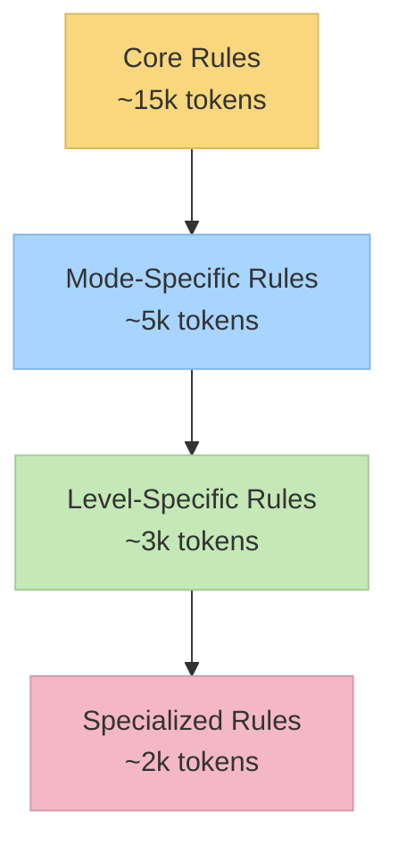

# RFC: Cursor Memory Bank System v0.7-beta (Референсная система)

## 1. Метаданные документа

- **Название**: Cursor Memory Bank System v0.7-beta - Анализ референсной архитектуры
- **Версия RFC**: 1.0
- **Дата создания**: 2025-01-02
- **Автор**: Jarvis (System DevOps Engineer)
- **Статус**: Analysis Complete
- **Тип**: Reference Architecture Analysis

## 2. Аннотация

Cursor Memory Bank System v0.7-beta представляет собой токен-оптимизированную, иерархическую систему управления задачами, разработанную специально для Cursor IDE. Система реализует структурированный подход к разработке через специализированные режимы для различных фаз процесса разработки.

## 3. Мотивация и проблемы

### 3.1 Оригинальная проблема
- **Inefficient AI Usage**: Стандартные AI-ассистенты не сохраняют контекст между сессиями
- **Token Waste**: Загрузка всех правил сразу приводила к избыточному использованию токенов
- **Lack of Structure**: Отсутствие структурированного подхода к разработке
- **Context Loss**: Потеря контекста при переключении между задачами

### 3.2 Целевые пользователи
- Software Engineers с опытом
- Разработчики, использующие Cursor IDE
- Команды, нуждающиеся в structured development workflow

## 4. Детальный дизайн

### 4.1 Архитектурные принципы

#### 4.1.1 Иерархическая загрузка правил


#### 4.1.2 Структура режимов
```
VAN (Initialization) → PLAN (Planning) → CREATIVE (Design) → IMPLEMENT (Building) → REFLECT (Review) → ARCHIVE (Documentation)
```

### 4.2 Компоненты системы

#### 4.2.1 Custom Modes Infrastructure
```bash
custom_modes/
├── van_instructions.md         # VAN режим - инициализация
├── plan_instructions.md        # PLAN режим - планирование  
├── creative_instructions.md    # CREATIVE режим - дизайн
├── implement_instructions.md   # IMPLEMENT режим - разработка
├── reflect_archive_instructions.md  # REFLECT/ARCHIVE - ревью/архив
└── memory_bank_modes.json      # Конфигурация режимов
```

#### 4.2.2 Isolation Rules Infrastructure
```bash
.cursor/rules/isolation_rules/
├── main.mdc                    # Основные правила
├── main-optimized.mdc          # Оптимизированные правила
├── Core/                       # Основные правила (всегда загружены)
│   ├── hierarchical-rule-loading.mdc
│   ├── mode-transition-optimization.mdc
│   └── optimization-integration.mdc
├── Level1/                     # Level 1 workflows
├── Level2/                     # Level 2 workflows  
├── Level3/                     # Level 3 workflows
├── Level4/                     # Level 4 workflows
├── Phases/
│   └── CreativePhase/          # Специализированные creative rules
└── visual-maps/                # Процессные карты
    ├── van_mode_split/
    ├── plan-mode-map.mdc
    ├── creative-mode-map.mdc
    ├── implement-mode-map.mdc
    └── qa-mode-map.mdc
```

#### 4.2.3 Memory Bank Files
```bash
memory-bank/
├── tasks.md              # Single Source of Truth
├── activeContext.md      # Текущий контекст
├── progress.md           # Прогресс реализации
├── projectbrief.md       # Основа проекта
├── creative/             # Документы дизайн-решений
│   └── creative-template.md
└── reflection/           # Документы ревью
    └── reflect-template.md
```

### 4.3 Инновационные решения

#### 4.3.1 Token Optimization Strategy
- **Hierarchical Loading**: Загрузка только необходимых правил
- **Progressive Documentation**: Масштабирование документации по сложности
- **Lazy Rule Loading**: Загрузка специализированных правил по требованию
- **Context Preservation**: Эффективное сохранение контекста между режимами

#### 4.3.2 Complexity-Based Workflows
- **Level 1**: Quick fixes (VAN → IMPLEMENT)
- **Level 2**: Simple features (VAN → PLAN → IMPLEMENT → REFLECT)
- **Level 3-4**: Complex features (Full workflow)

#### 4.3.3 CREATIVE Mode Enhancement
Реализует методологию Claude "Think" tool:
- Progressive documentation with tabular comparisons
- Detail-on-demand approach
- Structured templates scaling with complexity
- Efficient context preservation

### 4.4 Технические характеристики

#### 4.4.1 Token Efficiency
| Компонент | Original | Optimized | Reduction |
|-----------|----------|-----------|-----------|
| Initial Load | ~70,000 | ~15,000 | 78% |
| Total Usage | ~70,000 | ~25,000 | 64% |

#### 4.4.2 Supported Platforms
- Cursor IDE (primary target)
- Claude 4 Sonnet/Opus (recommended AI models)

#### 4.4.3 Installation Tools
- `bootstrap_memory_bank.py` - создание Memory Bank структуры
- `generate_cursor_modes.py` - генерация cursor modes конфигурации
- Cursor UI integration для import/export режимов

## 5. Использование

### 5.1 Установка
```bash
# 1. Clone repository
git clone https://github.com/vanzan01/cursor-memory-bank.git

# 2. Bootstrap Memory Bank files
python tools/bootstrap_memory_bank.py --dest /path/to/project/memory_bank

# 3. Generate cursor modes
python tools/generate_cursor_modes.py --output cursor_modes/cursor_modes.json

# 4. Import in Cursor UI
Settings → Chat → Custom modes → Import custom modes
```

### 5.2 Workflow
```bash
# Start with VAN mode
VAN  # Analyze project, determine complexity

# Follow complexity-based workflow
PLAN      # Create detailed plan (Level 2+)
CREATIVE  # Design decisions (Level 3-4)
IMPLEMENT # Build components
REFLECT   # Review and document
ARCHIVE   # Final documentation

# QA available from any mode
QA  # Technical validation
```

## 6. Преимущества

### 6.1 Технические преимущества
- **Token Efficiency**: 64% reduction in token usage
- **Context Preservation**: Persistent state across sessions
- **Structured Development**: Clear phase-based workflow
- **Scalability**: Adapts to project complexity

### 6.2 Пользовательские преимущества
- **Consistent Quality**: Structured approach ensures quality
- **Knowledge Preservation**: Memory Bank maintains project history
- **Adaptive Workflow**: Scales from quick fixes to complex features
- **AI Enhancement**: Optimized for AI-assisted development

## 7. Ограничения

### 7.1 Технические ограничения
- **Cursor IDE Dependency**: Работает только в Cursor IDE
- **Manual Setup**: Требует ручной настройки custom modes
- **Learning Curve**: Необходимо изучение workflow принципов
- **File Management**: Требует поддержания Memory Bank структуры

### 7.2 Экосистемные ограничения
- **Single IDE Support**: Не поддерживает другие IDE
- **Model Dependency**: Оптимизировано для Claude models
- **Community Size**: Ограниченная экосистема расширений

## 8. Альтернативы

### 8.1 Рассмотренные альтернативы
- **Standard Cursor workflow**: Базовый функционал без Memory Bank
- **Manual project management**: Традиционные методы управления проектами
- **Other AI-assisted tools**: GitHub Copilot, Tabnine, CodeWhisperer

### 8.2 Сравнение
| Аспект | Memory Bank | Standard Tools | Manual Methods |
|--------|-------------|----------------|----------------|
| Context Preservation | ✅ Excellent | ❌ Poor | ⚠️ Manual |
| Token Efficiency | ✅ Optimized | ❌ Wasteful | N/A |
| Structure | ✅ Built-in | ❌ Ad-hoc | ⚠️ Manual |
| Learning Curve | ⚠️ Medium | ✅ Low | ✅ None |

## 9. Будущее развитие

### 9.1 Roadmap указанный автором
Автор указывает на эволюцию в направлении **Claude Code Sub-Agent Collective**:
- Three-Tier Orchestration Architecture
- Advanced prompt engineering
- Specialized agents
- From setup tools to working prototypes

### 9.2 Потенциальные улучшения
- Dynamic template generation
- Automatic context summarization  
- Cross-task knowledge preservation
- Adaptive rule partitioning

## 10. Заключение

Cursor Memory Bank System v0.7-beta представляет собой зрелую, оптимизированную систему для структурированной разработки с AI-ассистентом. Система успешно решает проблемы token efficiency, context preservation и structured workflow, но ограничена экосистемой Cursor IDE.

Ключевые достижения:
- **64% token reduction** при сохранении функциональности
- **Hierarchical rule loading** для оптимизации
- **Phase-based workflow** для структурированной разработки
- **Memory Bank persistence** для сохранения контекста

Система подходит для experienced developers, работающих в Cursor IDE и нуждающихся в structured approach к AI-assisted development.

---

**Документ подготовлен**: Jarvis (System DevOps Engineer)  
**Дата**: 2025-01-02  
**Источник**: [cursor-memory-bank v0.7-beta](https://github.com/vanzan01/cursor-memory-bank)