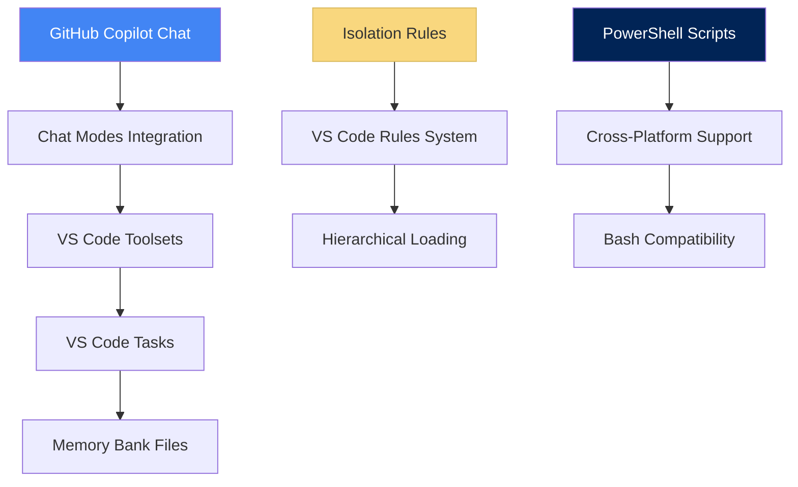

# RFC: VS Code Memory Bank System v0.7-beta-vscode (Наша реализация)

## 1. Метаданные документа

- **Название**: VS Code Memory Bank System v0.7-beta-vscode - Адаптация для Visual Studio Code
- **Версия RFC**: 1.0
- **Дата создания**: 2025-01-02
- **Автор**: Jarvis (System DevOps Engineer)
- **Статус**: Implementation Complete
- **Тип**: Implementation Architecture

## 2. Аннотация

VS Code Memory Bank System представляет собой адаптацию cursor-memory-bank v0.7-beta для экосистемы Visual Studio Code. Система сохраняет все ключевые принципы оригинала (иерархическая загрузка правил, token optimization, phase-based workflow), но адаптируется под инфраструктуру VS Code через GitHub Copilot Chat, VS Code Tasks и Toolsets.

## 3. Мотивация и проблемы

### 3.1 Проблемы адаптации

- **IDE Compatibility Gap**: cursor-memory-bank работает только в Cursor IDE
- **Tooling Differences**: VS Code имеет другую систему custom modes и rules
- **Integration Challenges**: Необходимость интеграции с GitHub Copilot Chat
- **Platform Adaptation**: Адаптация под Windows/PowerShell environment

### 3.2 Целевые пользователи

- Software Engineers, использующие VS Code
- Teams, работающие с GitHub Copilot
- DevOps Engineers, нуждающиеся в structured workflows
- Разработчики, желающие перейти с Cursor на VS Code без потери Memory Bank функциональности

## 4. Детальный дизайн

### 4.1 Архитектурные принципы адаптации

#### 4.1.1 Multi-Platform Integration Strategy



#### 4.1.2 Адаптированная структура режимов

```text
VAN (Initialization) → PLAN (Planning) → CREATIVE (Design) → IMPLEMENT (Building) → REFLECT (Review) → ARCHIVE (Documentation)
│                                                                                                                              │
└── GitHub Copilot Chat Modes ──────────────────────────────────────────────────────────────────────────────────────────────┘
```

### 4.2 Компоненты адаптированной системы

#### 4.2.1 GitHub Copilot Chat Modes

```bash
.github/chatmodes/
├── VAN.chatmode.md              # VAN режим - инициализация
├── PLAN.chatmode.md             # PLAN режим - планирование
├── CREATIVE.chatmode.md         # CREATIVE режим - дизайн
├── IMPLEMENT.chatmode.md        # IMPLEMENT режим - разработка
├── REFLECT.chatmode.md          # REFLECT режим - ревью
└── ARCHIVE.chatmode.md          # ARCHIVE режим - архивирование
```

#### 4.2.2 VS Code Toolsets Integration

```jsonc
// .vscode/settings.json - MemoryBank.toolsets.jsonc
{
  "chat.modes": {
    "MemoryBankWorkflow": {
      "intent": "Complete Memory Bank workflow system",
      "tools": ["edit", "new", "search", "runCommands", "ask"]
    },
    "MBWorkflow_VAN": {
      "intent": "VAN: Project analysis and complexity determination",
      "tools": ["search", "ask", "edit"]
    },
    "MBWorkflow_PLAN": {
      "intent": "PLAN: Detailed task planning and breakdown",
      "tools": ["edit", "new", "search"]
    }
    // ... other toolsets
  }
}
```

#### 4.2.3 VS Code Rules System

```bash
.vscode/rules/isolation_rules/
├── main.mdc                     # Основные правила (copied from cursor)
├── main-optimized.mdc           # Оптимизированные правила
├── Core/                        # Основные правила
│   ├── platform-awareness.mdc   # Platform-specific commands
│   ├── file-verification.mdc    # File existence checks
│   └── command-execution.mdc    # Command execution patterns
├── Level1/ through Level4/      # Complexity-based workflows
├── Phases/
│   └── CreativePhase/           # Creative phase specializations
└── visual-maps/                 # Process maps for each mode
    ├── van_mode_split/
    ├── plan-mode-map.mdc
    ├── creative-mode-map.mdc
    ├── implement-mode-map.mdc
    └── qa-mode-map.mdc
```

#### 4.2.4 VS Code Tasks Integration

```json
// .vscode/tasks.json
{
  "tasks": [
    {
      "label": "🔍 VAN: Initialize Project",
      "type": "shell",
      "command": "echo",
      "args": ["=== VAN MODE: PROJECT INITIALIZATION ==="]
    },
    {
      "label": "📊 Memory Bank Status",
      "type": "shell",
      "command": "powershell",
      "args": ["-File", ".vscode/memory-bank/scripts/memory-bank.ps1", "status"]
    }
    // ... other tasks
  ]
}
```

#### 4.2.5 Memory Bank Files (Unchanged Core)

```bash
.vscode/memory-bank/
├── tasks.md                     # Single Source of Truth
├── activeContext.md             # Текущий контекст
├── progress.md                  # Прогресс реализации
├── projectbrief.md              # Основа проекта
├── creative/                    # Документы дизайн-решений
│   └── creative-template.md
├── reflection/                  # Документы ревью
│   └── reflect-template.md
└── scripts/
    └── memory-bank.ps1          # PowerShell management script
```

### 4.3 Инновационные решения адаптации

#### 4.3.1 Multi-IDE Strategy

- **Chat Modes Mapping**: Cursor custom modes → GitHub Copilot Chat modes
- **Toolsets Integration**: VS Code predefined tools integration
- **Task Automation**: VS Code Tasks для Memory Bank operations
- **Cross-Platform Scripts**: PowerShell + Bash compatibility

#### 4.3.2 Platform-Aware Command Execution

```powershell
# .vscode/memory-bank/scripts/memory-bank.ps1
param(
    [Parameter(Mandatory=$true)]
    [ValidateSet("init", "status", "update", "recount")]
    [string]$Action
)

# Platform detection and appropriate command execution
```

#### 4.3.3 Documentation Automation Integration

- **npm scripts**: Integration with documentation system
- **Watch mode**: Real-time documentation monitoring
- **Validation**: Automatic documentation quality checks

### 4.4 Технические характеристики

#### 4.4.1 Поддерживаемые платформы

| Platform | Support Level | Notes |
|----------|---------------|-------|
| Windows | ✅ Primary | PowerShell + Git Bash |
| Linux | ✅ Compatible | Bash scripts available |
| macOS | ✅ Compatible | Bash scripts available |

#### 4.4.2 Dependencies

- VS Code 1.80+
- GitHub Copilot extension
- PowerShell 5.1+ (Windows)
- Bash (Linux/macOS)
- Node.js/npm (for documentation automation)

#### 4.4.3 Token Efficiency (Preserved)

| Component | Original Cursor | VS Code Adaptation | Change |
|-----------|-----------------|-------------------|--------|
| Initial Load | ~15,000 | ~15,000 | No change |
| Total Usage | ~25,000 | ~25,000 | No change |
| Rule Loading | Hierarchical | Hierarchical | Preserved |

## 5. Использование

### 5.1 Установка

```bash
# 1. Структура уже готова в проекте
ls .vscode/memory-bank/

# 2. Initialize Memory Bank (если нужно)
.vscode/memory-bank/scripts/memory-bank.ps1 init

# 3. Check status
.vscode/memory-bank/scripts/memory-bank.ps1 status

# 4. VS Code Tasks доступны через Ctrl+Shift+P → "Tasks: Run Task"
```

### 5.2 Workflow (Адаптированный)

```bash
# В GitHub Copilot Chat
VAN      # Initialize and analyze (mapped to MBWorkflow_VAN toolset)
PLAN     # Create detailed plan (mapped to MBWorkflow_PLAN toolset)
CREATIVE # Design decisions (mapped to MBWorkflow_CREATIVE toolset)
IMPLEMENT # Build components (mapped to MBWorkflow_IMPLEMENT toolset)
REFLECT  # Review and document (mapped to MBWorkflow_REFLECT toolset)
QA       # Technical validation (available from any mode)
```

### 5.3 VS Code Integration Features

```bash
# VS Code Tasks
Ctrl+Shift+P → Tasks: Run Task → "📊 Memory Bank Status"
Ctrl+Shift+P → Tasks: Run Task → "🔄 Update Memory Bank"
Ctrl+Shift+P → Tasks: Run Task → "🧹 Memory Bank: Recount & Fix"

# GitHub Copilot Chat Modes
# Режимы активируются автоматически при typing commands в Chat
```

## 6. Преимущества адаптации

### 6.1 Технические преимущества

- **Multi-IDE Support**: Работает в VS Code, не требует Cursor
- **Ecosystem Integration**: Полная интеграция с VS Code ecosystem
- **Cross-Platform**: Windows/Linux/macOS support
- **Automation**: VS Code Tasks + PowerShell automation
- **Preserved Optimization**: Все token optimizations сохранены

### 6.2 Пользовательские преимущества

- **Familiar Environment**: Остается в привычной VS Code среде
- **GitHub Integration**: Native GitHub Copilot integration
- **Team Collaboration**: Sharable через git repository
- **Documentation Automation**: Integrated docs workflow

## 7. Ограничения адаптации

### 7.1 Технические ограничения

- **GitHub Copilot Dependency**: Требует GitHub Copilot subscription
- **Chat Modes Limitations**: Менее rich UI по сравнению с Cursor
- **Manual Setup**: Все еще требует initial setup
- **Platform Scripts**: Необходимость поддержки multiple script formats

### 7.2 Функциональные ограничения

- **No Visual UI**: Отсутствует visual interface Cursor для режимов
- **Chat-Based Interaction**: Все взаимодействие через chat commands
- **Limited Toolsets**: VS Code toolsets limited to predefined tools

## 8. Сравнение с референсной системой

### 8.1 Архитектурное сравнение

| Аспект | Cursor Original | VS Code Adaptation | Status |
|--------|-----------------|-------------------|--------|
| Custom Modes | `.cursor/` + UI | `.github/chatmodes/` | ✅ Adapted |
| Rules System | `.cursor/rules/` | `.vscode/rules/` | ✅ Preserved |
| Memory Bank | `memory-bank/` | `.vscode/memory-bank/` | ✅ Enhanced |
| Token Optimization | Hierarchical | Hierarchical | ✅ Preserved |
| Automation | Python tools | VS Code Tasks + PowerShell | ✅ Improved |
| Platform Support | Cursor only | Multi-platform | ✅ Enhanced |

### 8.2 Функциональное сравнение

| Feature | Cursor | VS Code | Notes |
|---------|--------|---------|-------|
| Mode Switching | UI buttons | Chat commands | Different UX, same functionality |
| Rule Loading | Native | Through Chat | Preserved hierarchy |
| File Management | Direct | Through tools | VS Code tools integration |
| Automation | Python scripts | Tasks + PowerShell | Enhanced automation |
| Documentation | Manual | Automated | npm scripts integration |

## 9. Миграционный путь

### 9.1 Миграция с Cursor

```bash
# 1. Copy Memory Bank files
cp -r cursor-project/memory-bank/ vscode-project/.vscode/memory-bank/

# 2. Copy rules
cp -r cursor-project/.cursor/rules/ vscode-project/.vscode/rules/

# 3. Initialize VS Code setup
.vscode/memory-bank/scripts/memory-bank.ps1 init

# 4. Test workflow
# В GitHub Copilot Chat: VAN
```

### 9.2 Обратная совместимость

- Memory Bank files полностью совместимы
- Rules system preserved
- Workflow commands идентичны
- Documentation structure unchanged

## 10. Будущее развитие

### 10.1 Планируемые улучшения

- **VS Code Extension**: Native Memory Bank extension для VS Code
- **Enhanced Toolsets**: Custom tools для Memory Bank operations
- **UI Integration**: Visual interface для mode switching
- **Multi-Repository Support**: Support для multiple project Memory Banks

### 10.2 Интеграция с экосистемой

- **VS Code Marketplace**: Публикация как extension
- **GitHub Actions**: CI/CD integration для Memory Bank workflows
- **Team Collaboration**: Enhanced sharing and collaboration features

## 11. Заключение

VS Code Memory Bank System v0.7-beta-vscode успешно адаптирует cursor-memory-bank для экосистемы VS Code, сохраняя все ключевые преимущества оригинала при добавлении multi-platform support и enhanced automation.

### 11.1 Ключевые достижения

- **✅ Full Feature Parity**: Все функции cursor-memory-bank preserved
- **✅ Multi-Platform Support**: Windows/Linux/macOS compatibility
- **✅ Enhanced Automation**: VS Code Tasks + PowerShell scripts
- **✅ Ecosystem Integration**: Native VS Code + GitHub Copilot integration
- **✅ Token Efficiency Preserved**: Все оптимизации сохранены

### 11.2 Рекомендации

**Выбирать VS Code адаптацию если**:
- Уже используете VS Code как primary IDE
- Имеете GitHub Copilot subscription
- Нужна cross-platform compatibility
- Команда работает в VS Code ecosystem

**Оставаться на Cursor если**:
- Уже настроен workflow в Cursor
- Предпочитаете visual UI для mode switching
- Команда полностью committed to Cursor

---

**Документ подготовлен**: Jarvis (System DevOps Engineer)  
**Дата**: 2025-01-02  
**Статус**: Implementation Complete  
**Репозиторий**: E:/My/Telegram/NanoBanana