# Architecture Diagrams: Vibecode Spec Kit

**Document Type**: Architecture Diagrams Documentation  
**Project**: Vibecode Spec Kit - Modern Spec Development Kit  
**Version**: 2.0  
**Date**: 2025-01-04  
**Status**: ✅ COMPLETED  

---

## 📋 Overview

This document provides comprehensive architectural diagrams for the VS Code Memory Bank project, illustrating system components, data flow, workflows, and integration patterns using Mermaid diagrams.

---

## 🏗️ System Architecture Overview

### High-Level System Architecture


---

## 🔧 Component Architecture

### Core System Components


---

## 📁 Memory Bank Structure

### File System Architecture

```mermaid
graph TD
    subgraph "memory-bank/"
        ROOT[Memory Bank Root]
        
        subgraph "Core Files"
            TASKS[tasks.md<br/>Active Tasks]
            CONTEXT[activeContext.md<br/>Session Context]
            PROGRESS[progress.md<br/>Project Progress]
        end
        
        subgraph "Subdirectories"
            CREATIVE[creative/<br/>Creative Phase Docs]
            REFLECTION[reflection/<br/>Reflection Docs]
            ARCHIVE[archive/<br/>Completed Tasks]
        end
        
        subgraph "Template Files"
            SPEC_TEMP[spec-template.md<br/>Specification Template]
            PLAN_TEMP[plan-template.md<br/>Planning Template]
            TASK_TEMP[tasks-template.md<br/>Task Template]
            CONST_TEMP[constitution.md<br/>Constitutional Template]
        end
    end
    
    ROOT --> TASKS
    ROOT --> CONTEXT
    ROOT --> PROGRESS
    ROOT --> CREATIVE
    ROOT --> REFLECTION
    ROOT --> ARCHIVE
    ROOT --> SPEC_TEMP
    ROOT --> PLAN_TEMP
    ROOT --> TASK_TEMP
    ROOT --> CONST_TEMP
    
    CREATIVE --> CREATIVE_DOCS[creative-[feature].md]
    REFLECTION --> REFLECTION_DOCS[reflection-[task_id].md]
    ARCHIVE --> ARCHIVE_DOCS[archive-[task_id].md]
    
    style ROOT fill:#e1f5fe
    style TASKS fill:#e8f5e8
    style CONTEXT fill:#fff3e0
    style PROGRESS fill:#f3e5f5
    style CREATIVE fill:#f1f8e9
    style REFLECTION fill:#e3f2fd
    style ARCHIVE fill:#fff8e1
```

---

## 🔄 Workflow Architecture

### Mode Transition Flow


---

## 🧠 AI Agent Integration

### Multi-Agent Architecture


---

## 📊 Template System Architecture

### Adaptive Complexity Templates


---

## 🔍 Research System Architecture

### AI-Powered Research Pipeline


---

## 🔄 Data Flow Architecture

### Information Flow Through System


---

## 🧪 Testing Architecture

### Test Framework Structure


---

## 🔒 Validation Gates Architecture

### Mode Transition Validation

```mermaid
graph TD
    subgraph "Validation Gates System"
        VAL_GATES[Validation Gates Manager]
        
        subgraph "Gate Types"
            SPEC_GATE[Spec Gate<br/>Specification Validation]
            CONST_GATE[Constitutional Gate<br/>Constitutional Compliance]
            RESEARCH_GATE[Research Gate<br/>Research Validation]
            TEST_GATE[Test Gate<br/>Test Validation]
        end
        
        subgraph "Validation Results"
            PASS[Validation Pass<br/>Proceed to Next Mode]
            FAIL[Validation Fail<br/>Fix Issues Required]
            WARN[Validation Warning<br/>Proceed with Caution]
            SKIP[Validation Skip<br/>Skip Validation]
        end
        
        subgraph "Mode Transitions"
            VAN_TO_PLAN[VAN → PLAN]
            PLAN_TO_CREATIVE[PLAN → CREATIVE]
            CREATIVE_TO_IMPLEMENT[CREATIVE → IMPLEMENT]
            IMPLEMENT_TO_REFLECT[IMPLEMENT → REFLECT]
            REFLECT_TO_ARCHIVE[REFLECT → ARCHIVE]
        end
    end
    
    VAL_GATES --> SPEC_GATE
    VAL_GATES --> CONST_GATE
    VAL_GATES --> RESEARCH_GATE
    VAL_GATES --> TEST_GATE
    
    SPEC_GATE --> PASS
    CONST_GATE --> FAIL
    RESEARCH_GATE --> WARN
    TEST_GATE --> SKIP
    
    PASS --> VAN_TO_PLAN
    FAIL --> VAN_TO_PLAN
    WARN --> PLAN_TO_CREATIVE
    SKIP --> CREATIVE_TO_IMPLEMENT
    
    VAN_TO_PLAN --> PLAN_TO_CREATIVE
    PLAN_TO_CREATIVE --> CREATIVE_TO_IMPLEMENT
    CREATIVE_TO_IMPLEMENT --> IMPLEMENT_TO_REFLECT
    IMPLEMENT_TO_REFLECT --> REFLECT_TO_ARCHIVE
    
    style VAL_GATES fill:#e1f5fe
    style SPEC_GATE fill:#e8f5e8
    style CONST_GATE fill:#fff3e0
    style RESEARCH_GATE fill:#f3e5f5
    style TEST_GATE fill:#fce4ec
    style PASS fill:#c8e6c9
    style FAIL fill:#ffcdd2
    style WARN fill:#fff9c4
```



---

## 📈 Performance Architecture

### System Performance Flow


---

## 🚀 Deployment Architecture

### System Deployment Flow


---

## 📊 Integration Architecture

### External System Integration


---

## 🎯 Summary

This comprehensive set of architectural diagrams illustrates the complete structure and operation of the VS Code Memory Bank project:

### Key Architecture Components:
1. **System Overview** - High-level system architecture
2. **Component Architecture** - Detailed component relationships
3. **Memory Bank Structure** - File system organization
4. **Workflow Architecture** - Mode transition flow
5. **AI Agent Integration** - Multi-agent management
6. **Template System** - Adaptive complexity templates
7. **Research System** - AI-powered research pipeline
8. **Data Flow** - Information flow through system
9. **Testing Architecture** - Comprehensive testing framework
10. **Validation Gates** - Mode transition validation
11. **Performance Architecture** - Performance monitoring
12. **Deployment Architecture** - Deployment pipeline
13. **Integration Architecture** - External system integration

### Architecture Benefits:
- **Modular Design** - Clear separation of concerns
- **Scalable Structure** - Designed for future expansion
- **Quality Assurance** - Built-in validation and testing
- **Performance Optimized** - Caching and optimization systems
- **Integration Ready** - External system compatibility
- **Documentation Driven** - Comprehensive documentation support

The architecture demonstrates a well-designed, enterprise-ready system that successfully integrates modern development methodologies with advanced AI capabilities while maintaining high standards of quality, performance, and maintainability.

---

**Document Information**  
- **Created**: 2025-01-04  
- **Author**: AI Assistant  
- **Review Status**: Ready for Review  
- **Approval Required**: Technical Architecture Review
