# Диаграммы архитектуры: Vibecode Spec Kit

**Тип документа**: Документация диаграмм архитектуры  
**Проект**: Vibecode Spec Kit - Современный набор инструментов спецификаций разработки  
**Версия**: 2.0  
**Дата**: 2025-01-04  
**Статус**: ✅ ЗАВЕРШЕН  

---

## 📋 Обзор

Этот документ предоставляет комплексные архитектурные диаграммы для проекта VS Code Memory Bank, иллюстрируя компоненты системы, поток данных, рабочие процессы и паттерны интеграции с использованием диаграмм Mermaid.

---

## 🏗️ Обзор архитектуры системы

### Высокоуровневая архитектура системы

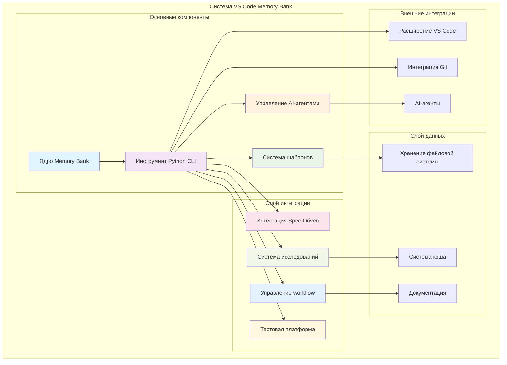

---

## 🔧 Архитектура компонентов

### Основные компоненты системы

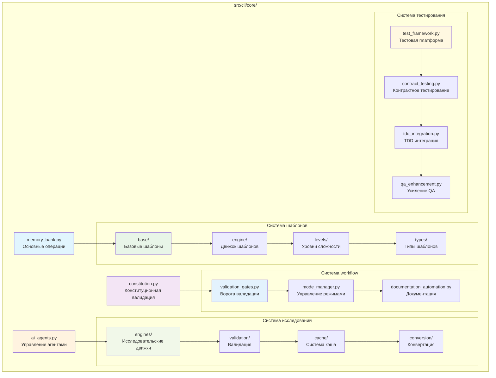

---

## 📁 Структура Memory Bank

### Архитектура файловой системы

```mermaid
graph TD
    subgraph "memory-bank/"
        ROOT[Корень Memory Bank]
        
        subgraph "Основные файлы"
            TASKS[tasks.md<br/>Активные задачи]
            CONTEXT[activeContext.md<br/>Контекст сессии]
            PROGRESS[progress.md<br/>Прогресс проекта]
        end
        
        subgraph "Поддиректории"
            CREATIVE[creative/<br/>Документы творческой фазы]
            REFLECTION[reflection/<br/>Документы рефлексии]
            ARCHIVE[archive/<br/>Завершенные задачи]
        end
        
        subgraph "Файлы шаблонов"
            SPEC_TEMP[spec-template.md<br/>Шаблон спецификации]
            PLAN_TEMP[plan-template.md<br/>Шаблон планирования]
            TASK_TEMP[tasks-template.md<br/>Шаблон задач]
            CONST_TEMP[constitution.md<br/>Конституционный шаблон]
        end
    end
    
    ROOT --> TASKS
    ROOT --> CONTEXT
    ROOT --> PROGRESS
    ROOT --> CREATIVE
    ROOT --> REFLECTION
    ROOT --> ARCHIVE
    ROOT --> SPEC_TEMP
    ROOT --> PLAN_TEMP
    ROOT --> TASK_TEMP
    ROOT --> CONST_TEMP
    
    CREATIVE --> CREATIVE_DOCS[creative-[feature].md]
    REFLECTION --> REFLECTION_DOCS[reflection-[task_id].md]
    ARCHIVE --> ARCHIVE_DOCS[archive-[task_id].md]
    
    style ROOT fill:#e1f5fe
    style TASKS fill:#e8f5e8
    style CONTEXT fill:#fff3e0
    style PROGRESS fill:#f3e5f5
    style CREATIVE fill:#f1f8e9
    style REFLECTION fill:#e3f2fd
    style ARCHIVE fill:#fff8e1
```

---

## 🔄 Архитектура workflow

### Поток переходов режимов

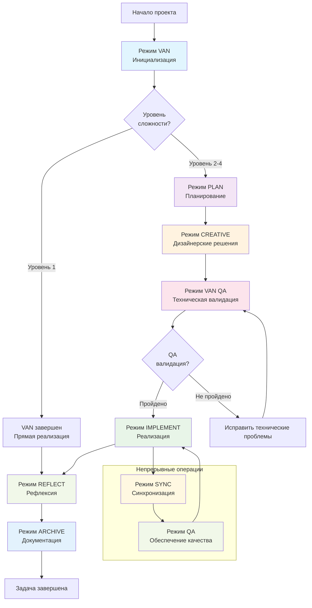

---

## 🧠 Интеграция AI-агентов

### Архитектура множественных агентов

```mermaid
graph TB
    subgraph "Управление AI-агентами"
        AI_MANAGER[Менеджер AI-агентов]
        
        subgraph "Поддерживаемые агенты"
            COPILOT[GitHub Copilot]
            CLAUDE[Claude Code]
            GEMINI[Gemini CLI]
            CURSOR[Cursor]
            QWEN[Qwen Code]
            WINDSURF[Windsurf]
            KILO[Kilo Code]
            AUGGIE[Auggie CLI]
            AMAZON[Amazon Q Developer]
            CODEX[Codex CLI]
        end
        
        subgraph "Функции агентов"
            CONFIG[Управление конфигурацией]
            PERF[Мониторинг производительности]
            VALID[Конституционная валидация]
            OPTIMIZE[Оптимизация]
        end
    end
    
    subgraph "Слой интеграции"
        CLI_INT[Интеграция CLI]
        TEMPLATE_INT[Интеграция шаблонов]
        RESEARCH_INT[Интеграция исследований]
        WORKFLOW_INT[Интеграция workflow]
    end
    
    AI_MANAGER --> COPILOT
    AI_MANAGER --> CLAUDE
    AI_MANAGER --> GEMINI
    AI_MANAGER --> CURSOR
    AI_MANAGER --> QWEN
    AI_MANAGER --> WINDSURF
    AI_MANAGER --> KILO
    AI_MANAGER --> AUGGIE
    AI_MANAGER --> AMAZON
    AI_MANAGER --> CODEX
    
    AI_MANAGER --> CONFIG
    AI_MANAGER --> PERF
    AI_MANAGER --> VALID
    AI_MANAGER --> OPTIMIZE
    
    CONFIG --> CLI_INT
    PERF --> TEMPLATE_INT
    VALID --> RESEARCH_INT
    OPTIMIZE --> WORKFLOW_INT
    
    style AI_MANAGER fill:#e1f5fe
    style COPILOT fill:#e8f5e8
    style CLAUDE fill:#fff3e0
    style GEMINI fill:#f3e5f5
    style CURSOR fill:#fce4ec
    style CONFIG fill:#f1f8e9
    style PERF fill:#e3f2fd
    style VALID fill:#fff8e1
```

---

## 📊 Архитектура системы шаблонов

### Адаптивные шаблоны сложности

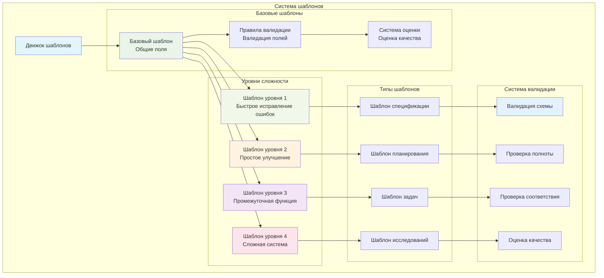

---

## 🔍 Архитектура системы исследований

### AI-powered исследовательский pipeline

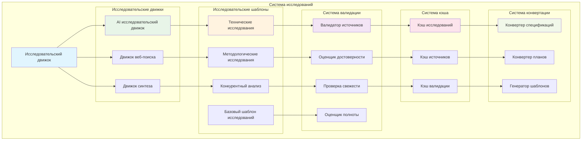

---

## 🔄 Архитектура потока данных

### Поток информации через систему

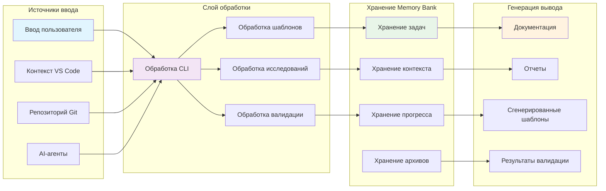

---

## 🧪 Архитектура тестирования

### Структура тестовой платформы

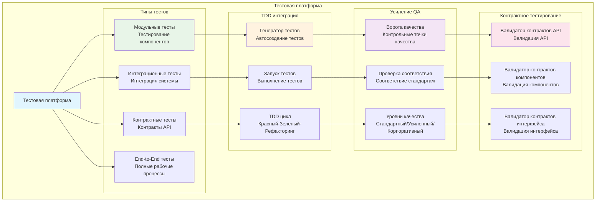

---

## 🔒 Архитектура ворот валидации

### Валидация переходов режимов

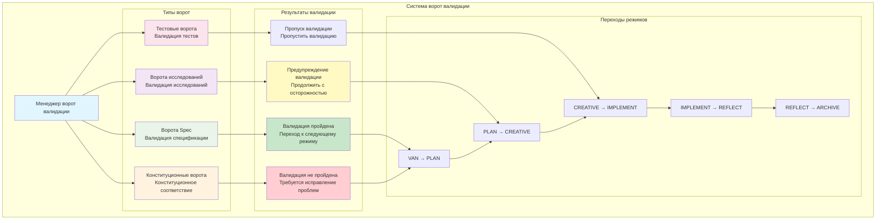

---

## 📈 Архитектура производительности

### Поток производительности системы

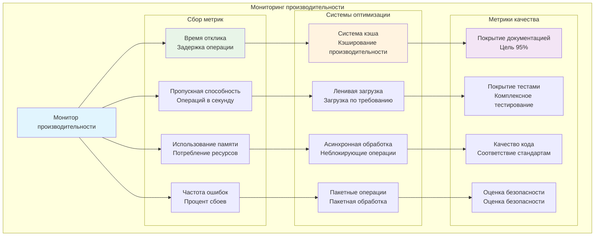

---

## 🚀 Архитектура развертывания

### Поток развертывания системы

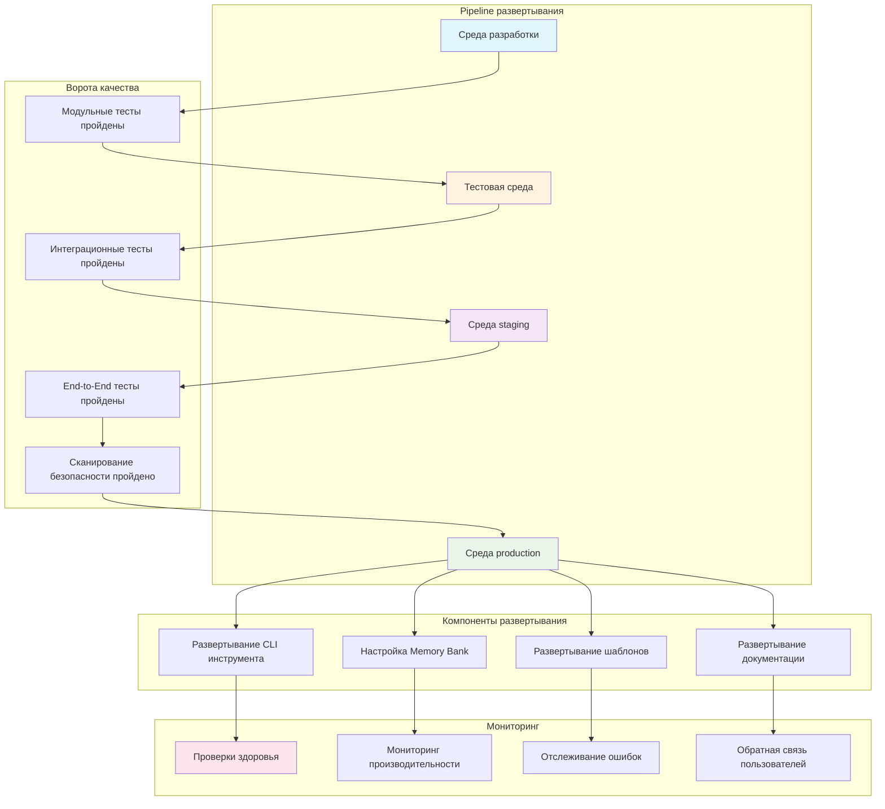

---

## 📊 Архитектура интеграции

### Интеграция внешних систем

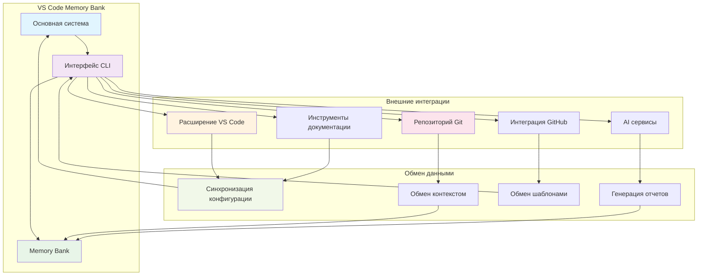

---

## 🎯 Резюме

Этот комплексный набор архитектурных диаграмм иллюстрирует полную структуру и работу проекта VS Code Memory Bank:

### Ключевые архитектурные компоненты:
1. **Обзор системы** - Высокоуровневая архитектура системы
2. **Архитектура компонентов** - Детальные отношения компонентов
3. **Структура Memory Bank** - Организация файловой системы
4. **Архитектура workflow** - Поток переходов режимов
5. **Интеграция AI-агентов** - Управление множественными агентами
6. **Система шаблонов** - Адаптивные шаблоны сложности
7. **Система исследований** - AI-powered исследовательский pipeline
8. **Поток данных** - Поток информации через систему
9. **Архитектура тестирования** - Комплексная тестовая платформа
10. **Ворота валидации** - Валидация переходов режимов
11. **Архитектура производительности** - Мониторинг производительности
12. **Архитектура развертывания** - Pipeline развертывания
13. **Архитектура интеграции** - Интеграция внешних систем

### Преимущества архитектуры:
- **Модульный дизайн** - Четкое разделение ответственности
- **Масштабируемая структура** - Разработано для будущего расширения
- **Обеспечение качества** - Встроенные валидация и тестирование
- **Оптимизация производительности** - Системы кэширования и оптимизации
- **Готовность к интеграции** - Совместимость с внешними системами
- **Документированность** - Комплексная поддержка документации

Архитектура демонстрирует хорошо спроектированную, готовую к enterprise систему, которая успешно интегрирует современные методологии разработки с продвинутыми AI возможностями, поддерживая высокие стандарты качества, производительности и поддерживаемости.

---

**Информация о документе**  
- **Создан**: 2025-01-04  
- **Автор**: AI Assistant  
- **Статус обзора**: Готов к обзору  
- **Требуется утверждение**: Технический архитектурный обзор
