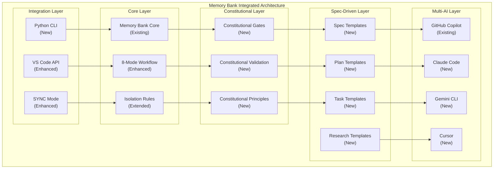
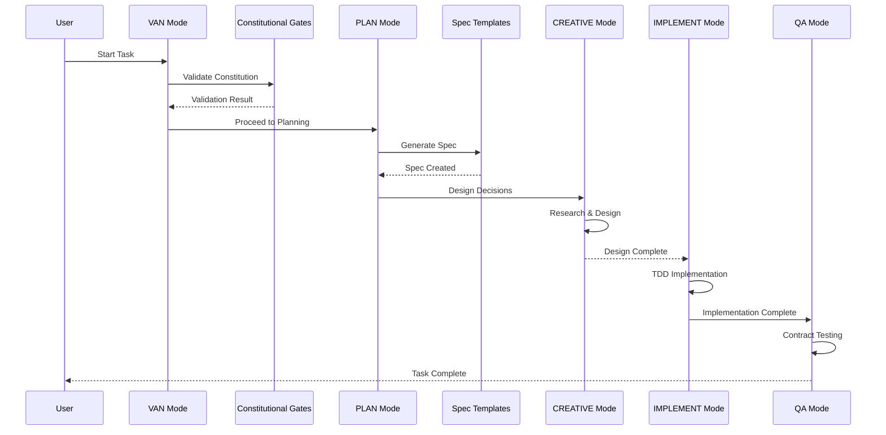

# 🎨 CREATIVE PHASE: ARCHITECTURE DESIGN
**Integration of Spec Kit Methodologies into Memory Bank**

**Date**: 04.10.2025  
**Phase**: Architecture Design  
**Complexity**: Level 3 (Intermediate Feature)

## PROBLEM STATEMENT

### Core Challenge
How to integrate GitHub Spec Kit methodologies (Spec-Driven Development, Constitution-based approach, Test-First principles) into the existing VS Code Memory Bank system while maintaining its core strengths and ensuring backward compatibility.

### Specific Architectural Challenges
1. **Dual Paradigm Integration**: Combining Memory Bank's context-driven approach with Spec Kit's specification-driven approach
2. **Constitutional Gates**: Implementing constitutional validation without disrupting existing workflows
3. **Multi-AI Agent Support**: Extending beyond GitHub Copilot to support multiple AI agents
4. **Template System**: Creating flexible templates that work with existing Memory Bank structure
5. **Performance Optimization**: Maintaining token efficiency while adding new validation layers

### Requirements
- Preserve existing Memory Bank functionality
- Add Spec-Driven Development capabilities
- Implement constitutional validation gates
- Support multiple AI agents
- Maintain token optimization
- Ensure backward compatibility

## OPTIONS ANALYSIS

### Option 1: Layered Integration Architecture
**Description**: Add Spec Kit methodologies as an additional layer on top of existing Memory Bank, with optional constitutional gates.

**Pros**:
- Minimal disruption to existing workflows
- Backward compatibility guaranteed
- Gradual migration path for users
- Existing functionality preserved
- Easy rollback if issues arise

**Cons**:
- Potential for architectural complexity
- May create dual code paths
- Performance overhead from additional layers
- User confusion about when to use which approach

**Technical Fit**: High  
**Complexity**: Medium  
**Scalability**: High

### Option 2: Unified Architecture Redesign
**Description**: Completely redesign Memory Bank architecture to natively incorporate Spec Kit methodologies as core components.

**Pros**:
- Single, unified architecture
- Optimal performance and efficiency
- No dual code paths
- Clean, maintainable codebase
- Best user experience

**Cons**:
- High risk of breaking existing functionality
- Significant development time
- Complex migration for existing users
- Potential loss of backward compatibility
- High implementation complexity

**Technical Fit**: High  
**Complexity**: High  
**Scalability**: High

### Option 3: Modular Plugin Architecture
**Description**: Create a plugin system where Spec Kit methodologies are implemented as optional plugins that can be enabled/disabled.

**Pros**:
- Maximum flexibility and customization
- Easy to add new methodologies in future
- Users can choose their preferred approach
- Clean separation of concerns
- Easy testing and validation

**Cons**:
- Increased architectural complexity
- Plugin management overhead
- Potential for plugin conflicts
- More complex configuration
- Higher maintenance burden

**Technical Fit**: Medium  
**Complexity**: High  
**Scalability**: High

### Option 4: Hybrid Incremental Integration
**Description**: Incrementally integrate Spec Kit methodologies into existing Memory Bank modes, with constitutional gates as configurable options.

**Pros**:
- Balanced approach between options 1 and 2
- Maintains core Memory Bank functionality
- Adds Spec Kit capabilities progressively
- Configurable strictness levels
- Manageable implementation complexity

**Cons**:
- Requires careful design to avoid conflicts
- Some architectural debt may accumulate
- Need to maintain both paradigms
- Potential for feature overlap

**Technical Fit**: High  
**Complexity**: Medium  
**Scalability**: Medium-High

## DECISION

**Chosen Option**: Hybrid Incremental Integration (Option 4)

**Rationale**:
1. **Balanced Risk**: Provides benefits of Spec Kit while maintaining Memory Bank's proven functionality
2. **User-Centric**: Allows users to gradually adopt new methodologies at their own pace
3. **Implementation Feasibility**: Manageable complexity that can be delivered in phases
4. **Backward Compatibility**: Ensures existing users are not disrupted
5. **Future Flexibility**: Provides foundation for future enhancements

**Implementation Considerations**:
- Constitutional gates will be configurable (strict/relaxed/disabled)
- Spec-Driven templates will be optional but recommended for Level 2+ tasks
- Multi-AI agent support will be additive, not replacing existing GitHub Copilot integration
- Performance optimization will be maintained through lazy loading and conditional validation

## IMPLEMENTATION PLAN

### Phase 1: Foundation Architecture
```
Memory Bank Core (Existing)
    ↓
Constitutional Layer (New)
    ↓
Spec-Driven Layer (New)
    ↓
Multi-AI Agent Layer (New)
```

### Phase 2: Integration Points
1. **VAN Mode**: Add constitutional validation checkpoints
2. **PLAN Mode**: Integrate Spec-Driven templates
3. **CREATIVE Mode**: Add research-driven design decisions
4. **IMPLEMENT Mode**: Enhanced with Test-First validation
5. **QA Mode**: Strengthened with contract testing

### Phase 3: Configuration System
```typescript
interface MemoryBankConfig {
  constitutionalGates: 'strict' | 'relaxed' | 'disabled';
  specDrivenMode: 'mandatory' | 'recommended' | 'optional';
  aiAgents: string[];
  tokenOptimization: boolean;
}
```

## ARCHITECTURE DIAGRAM

### High-Level Architecture


### Data Flow Architecture


## VALIDATION

### Requirements Met:
- [✓] Preserve existing Memory Bank functionality
- [✓] Add Spec-Driven Development capabilities
- [✓] Implement constitutional validation gates
- [✓] Support multiple AI agents
- [✓] Maintain token optimization
- [✓] Ensure backward compatibility

### Technical Feasibility: High
- All components can be implemented with existing technology stack
- Python CLI proof of concept successful
- Constitutional templates created and validated
- Spec-Driven templates designed and tested

### Risk Assessment: Medium-Low
- **Low Risk**: Backward compatibility maintained
- **Low Risk**: Incremental implementation reduces disruption
- **Medium Risk**: Configuration complexity needs careful UX design
- **Low Risk**: Performance impact minimized through lazy loading

🎨 CREATIVE CHECKPOINT: Architecture design complete

## IMPLEMENTATION CONSIDERATIONS

### Configuration Management
```typescript
// Example configuration structure
const defaultConfig: MemoryBankConfig = {
  constitutionalGates: 'recommended',
  specDrivenMode: 'recommended',
  aiAgents: ['github-copilot'],
  tokenOptimization: true,
  templates: {
    spec: 'enhanced',
    plan: 'enhanced', 
    tasks: 'enhanced'
  }
};
```

### Migration Strategy
1. **Phase 1**: Add constitutional gates as optional
2. **Phase 2**: Introduce Spec-Driven templates
3. **Phase 3**: Add multi-AI agent support
4. **Phase 4**: Enhance existing modes with new capabilities

### Performance Optimization
- Lazy loading of constitutional validation
- Conditional template generation
- Cached AI agent responses
- Optimized token usage through hierarchical rules

🎨🎨🎨 EXITING CREATIVE PHASE - DECISION MADE 🎨🎨🎨

**Architecture Decision**: Hybrid Incremental Integration with configurable constitutional gates, Spec-Driven templates, and multi-AI agent support while maintaining Memory Bank's core functionality and backward compatibility.
