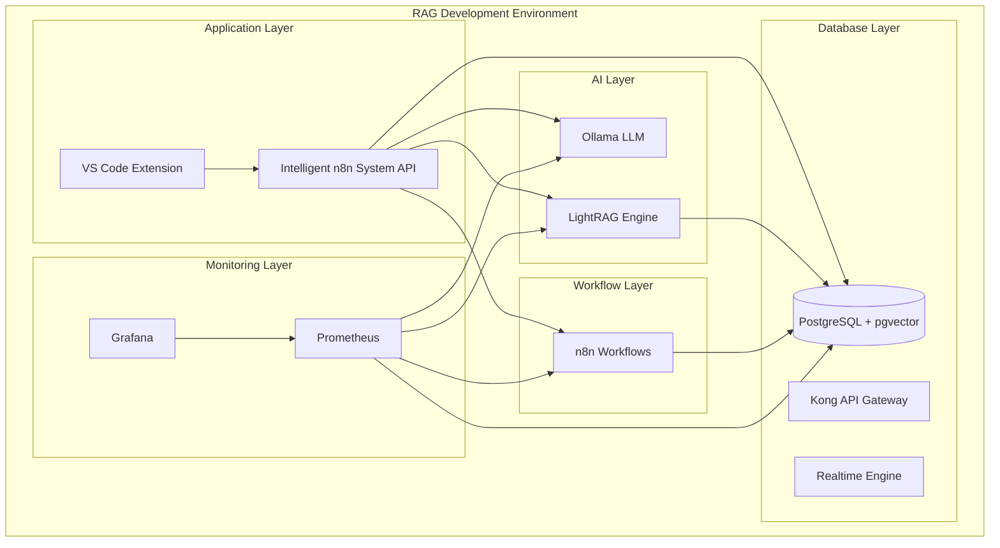

# CREATIVE PHASE: DOCKER ORCHESTRATION ARCHITECTURE

## 📌 CREATIVE PHASE START: Docker Services Architecture
━━━━━━━━━━━━━━━━━━━━━━━━━━━━━━━

## 1️⃣ PROBLEM
**Description**: Design optimal Docker orchestration for RAG-powered development environment
**Requirements**: 
- Seamless integration between Supabase, LightRAG, Ollama, n8n
- High availability and fault tolerance
- Resource optimization for Windows environment
- Easy development and production deployment
- Health monitoring and auto-recovery

**Constraints**: 
- Windows Docker Desktop environment
- Limited system resources (RAM/CPU)
- Network port management (5432, 8000, 11434, 5678)
- Security and data persistence requirements

## 2️⃣ OPTIONS

**Option A: Monolithic Docker Compose** - Single compose file with all services
**Option B: Microservices with Docker Swarm** - Distributed orchestration with Swarm
**Option C: Hybrid Architecture with Service Mesh** - Advanced networking with service discovery

## 3️⃣ ANALYSIS

| Criterion | Monolithic | Microservices | Hybrid |
|-----------|------------|---------------|--------|
| Setup Complexity | ⭐⭐ | ⭐⭐⭐⭐ | ⭐⭐⭐⭐⭐ |
| Resource Efficiency | ⭐⭐⭐ | ⭐⭐ | ⭐⭐ |
| Scalability | ⭐⭐ | ⭐⭐⭐⭐ | ⭐⭐⭐⭐⭐ |
| Maintenance | ⭐⭐⭐ | ⭐⭐ | ⭐⭐ |
| Development Speed | ⭐⭐⭐⭐⭐ | ⭐⭐ | ⭐⭐ |
| Fault Tolerance | ⭐⭐ | ⭐⭐⭐⭐ | ⭐⭐⭐⭐⭐ |

**Key Insights**:
- Monolithic approach offers fastest development and simplest setup
- Microservices provide better fault isolation but increase complexity
- Hybrid approach is overkill for current requirements but future-proof

## 4️⃣ DECISION
**Selected**: Option A: Monolithic Docker Compose with Smart Networking
**Rationale**: Best balance of simplicity, development speed, and sufficient fault tolerance for current scope

## 5️⃣ IMPLEMENTATION NOTES

### Architecture Components:
- **Supabase Stack**: PostgreSQL + pgvector + Kong + Realtime
- **AI Services**: Ollama + LightRAG with shared volume
- **Workflow Engine**: n8n with persistent storage
- **Monitoring**: Prometheus + Grafana for observability
- **Network**: Custom bridge network for service communication

### Key Design Decisions:
- Use named volumes for data persistence
- Implement health checks for all services
- Configure restart policies for fault tolerance
- Use environment variables for configuration
- Set resource limits to prevent system overload

### Network Architecture:

### Service Dependencies:
1. **Database First**: PostgreSQL must start before all other services
2. **AI Services**: Ollama and LightRAG can start in parallel
3. **Workflow Engine**: n8n depends on database and AI services
4. **Application Layer**: API depends on all infrastructure services
5. **Monitoring**: Prometheus and Grafana start last

### Health Check Strategy:
- **Database**: PostgreSQL connection + pgvector extension check
- **Ollama**: Model list endpoint availability
- **LightRAG**: Health endpoint + workspace accessibility
- **n8n**: API health endpoint + workflow execution capability
- **Monitoring**: Metrics collection and dashboard accessibility

━━━━━━━━━━━━━━━━━━━━━━━━━━━━━━━
## 📌 CREATIVE PHASE END: Docker Architecture Complete

## ✅ VERIFICATION CHECKLIST
- [x] Problem clearly defined
- [x] Multiple options considered (3)
- [x] Decision made with rationale
- [x] Implementation guidance provided
- [x] Network architecture diagrammed
- [x] Service dependencies mapped
- [x] Health check strategy defined
