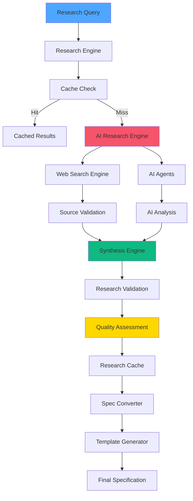
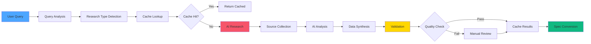
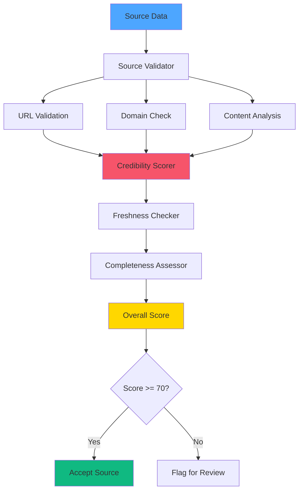
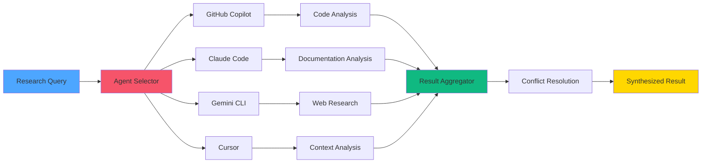

# 🎨 CREATIVE PHASE: Research Framework Design

**Date**: 04.10.2025  
**Phase**: Phase 2 - Spec-Driven Integration  
**Type**: Architecture Design  
**Complexity**: Level 3 (Intermediate Feature)

## PROBLEM STATEMENT

Необходимо спроектировать интегрированную систему исследований, которая автоматически собирает, валидирует и синтезирует технологическую информацию для поддержки Spec-Driven разработки. Система должна включать AI-ассистированные исследования, валидацию источников, конверсию исследований в спецификации и интеграцию с CREATIVE режимом Memory Bank.

### Ключевые Вызовы:
1. **Качество Исследований**: Обеспечение достоверности и актуальности собранной информации
2. **AI Интеграция**: Эффективное использование AI агентов для автоматизации исследований
3. **Конверсия в Спецификации**: Преобразование исследований в структурированные спецификации
4. **Валидация Источников**: Проверка достоверности и свежести информации

## OPTIONS ANALYSIS

### Option 1: Статическая Система Шаблонов Исследований
**Description**: Создание предопределенных шаблонов исследований с ручным заполнением и базовой валидацией.

**Pros**:
- Простота реализации
- Предсказуемый формат результатов
- Минимальные зависимости от внешних сервисов
- Легкое тестирование и отладка

**Cons**:
- Ограниченная автоматизация
- Ручная работа для каждого исследования
- Отсутствие динамической адаптации к новым технологиям
- Низкая эффективность для больших объемов

**Complexity**: Low  
**Implementation Time**: 25 minutes

### Option 2: AI-Ассистированная Система с Веб-Поиском
**Description**: Интеграция AI агентов с веб-поиском для автоматического сбора информации с валидацией источников и синтезом результатов.

**Pros**:
- Высокая автоматизация процесса
- Актуальная информация из веб-источников
- AI-синтез и структурирование данных
- Масштабируемость для различных типов исследований

**Cons**:
- Зависимость от внешних AI сервисов
- Потенциальные проблемы с качеством AI-синтеза
- Необходимость валидации веб-источников
- Сложность обработки противоречивой информации

**Complexity**: High  
**Implementation Time**: 50 minutes

### Option 3: Гибридная Система с Кэшированием и Валидацией
**Description**: Комбинация автоматизированных исследований с кэшированием результатов, многоуровневой валидацией и возможностью ручной корректировки.

**Pros**:
- Баланс между автоматизацией и контролем качества
- Кэширование повышает производительность
- Многоуровневая валидация обеспечивает достоверность
- Гибкость для различных типов исследований

**Cons**:
- Средняя сложность реализации
- Требует настройки валидационных правил
- Необходимость управления кэшем
- Потенциальная избыточность для простых исследований

**Complexity**: Medium  
**Implementation Time**: 40 minutes

## DECISION

**Выбранный Подход**: **Option 3: Гибридная Система с Кэшированием и Валидацией**

### Обоснование Выбора:
1. **Оптимальный Баланс**: Сочетает автоматизацию с контролем качества
2. **Производительность**: Кэширование ускоряет повторные исследования
3. **Надежность**: Многоуровневая валидация обеспечивает достоверность
4. **Гибкость**: Подходит для различных типов исследований
5. **Масштабируемость**: Легко адаптируется к новым требованиям

### Дополнительные Преимущества:
- Снижает нагрузку на внешние сервисы
- Обеспечивает консистентность результатов
- Позволяет постепенное улучшение качества
- Поддерживает как автоматические, так и ручные исследования

## IMPLEMENTATION PLAN

### 2.2.1 Архитектура Исследовательского Фреймворка

#### Основные Компоненты:
```
src/cli/core/research/
├── templates/
│   ├── research_template.py       # Базовый шаблон исследования
│   ├── tech_research_template.py  # Технологическое исследование
│   ├── methodology_template.py    # Исследование методологий
│   └── competitive_template.py    # Конкурентный анализ
├── engines/
│   ├── research_engine.py         # Основной движок исследований
│   ├── ai_research_engine.py      # AI-ассистированные исследования
│   ├── web_search_engine.py       # Веб-поиск
│   └── synthesis_engine.py        # Синтез результатов
├── validation/
│   ├── source_validator.py        # Валидация источников
│   ├── credibility_scorer.py      # Оценка достоверности
│   ├── freshness_checker.py       # Проверка актуальности
│   └── completeness_assessor.py   # Оценка полноты
├── cache/
│   ├── research_cache.py          # Кэш исследований
│   ├── source_cache.py            # Кэш источников
│   └── validation_cache.py        # Кэш валидации
└── conversion/
    ├── spec_converter.py          # Конверсия в спецификации
    ├── plan_converter.py          # Конверсия в планы
    └── template_generator.py      # Генерация шаблонов
```

#### Система Валидации:
```python
class ResearchValidator:
    def __init__(self):
        self.source_validator = SourceValidator()
        self.credibility_scorer = CredibilityScorer()
        self.freshness_checker = FreshnessChecker()
        self.completeness_assessor = CompletenessAssessor()
    
    def validate_research(self, research_data):
        """Комплексная валидация исследования"""
        validation_results = {
            'source_quality': self.source_validator.validate(research_data.sources),
            'credibility_score': self.credibility_scorer.score(research_data),
            'freshness': self.freshness_checker.check(research_data),
            'completeness': self.completeness_assessor.assess(research_data)
        }
        
        overall_score = self.calculate_overall_score(validation_results)
        return validation_results, overall_score
```

### 2.2.2 AI-Интеграция и Веб-Поиск

#### AI Research Engine:
```python
class AIResearchEngine:
    def __init__(self, ai_agents):
        self.ai_agents = ai_agents  # GitHub Copilot, Claude, Gemini, Cursor
        self.web_search = WebSearchEngine()
        self.synthesis_engine = SynthesisEngine()
    
    def conduct_research(self, research_query, research_type):
        """Проведение AI-ассистированного исследования"""
        # 1. Поиск информации
        web_results = self.web_search.search(research_query)
        
        # 2. AI-анализ и синтез
        ai_analysis = {}
        for agent in self.ai_agents:
            if agent.is_available():
                analysis = agent.analyze(web_results, research_type)
                ai_analysis[agent.name] = analysis
        
        # 3. Синтез результатов
        synthesized_results = self.synthesis_engine.synthesize(ai_analysis)
        
        return synthesized_results
```

### 2.2.3 Конверсия в Спецификации

#### Research-to-Specification Pipeline:
```python
class SpecConverter:
    def __init__(self):
        self.template_engine = TemplateEngine()
        self.validation_rules = ValidationRules()
    
    def convert_to_spec(self, research_data, complexity_level):
        """Конверсия исследования в спецификацию"""
        # 1. Генерация базовой спецификации
        spec_template = self.template_engine.generate_spec_template(complexity_level)
        
        # 2. Заполнение полей на основе исследования
        spec_data = self.map_research_to_spec(research_data, spec_template)
        
        # 3. Валидация и улучшение
        validated_spec = self.validation_rules.validate_and_improve(spec_data)
        
        return validated_spec
```

### 2.2.4 Система Кэширования

#### Research Cache:
```python
class ResearchCache:
    def __init__(self, cache_directory=".research_cache"):
        self.cache_dir = cache_directory
        self.cache_ttl = 86400  # 24 часа
    
    def get_cached_research(self, query_hash):
        """Получение кэшированного исследования"""
        cache_file = os.path.join(self.cache_dir, f"{query_hash}.json")
        
        if os.path.exists(cache_file):
            cache_time = os.path.getmtime(cache_file)
            if time.time() - cache_time < self.cache_ttl:
                with open(cache_file, 'r') as f:
                    return json.load(f)
        
        return None
    
    def cache_research(self, query_hash, research_data):
        """Кэширование результатов исследования"""
        os.makedirs(self.cache_dir, exist_ok=True)
        cache_file = os.path.join(self.cache_dir, f"{query_hash}.json")
        
        with open(cache_file, 'w') as f:
            json.dump(research_data, f, indent=2)
```

## VISUALIZATION

### Диаграмма Архитектуры Исследовательского Фреймворка:



### Диаграмма Потока Исследования:



### Система Валидации Источников:



### AI Agent Integration:



## 🎨 CREATIVE CHECKPOINT: Research Framework Design Complete

### Ключевые Решения:
1. **Гибридный Подход**: Сочетание автоматизации с контролем качества
2. **Многоуровневая Валидация**: Комплексная проверка источников и результатов
3. **AI Интеграция**: Использование всех доступных AI агентов для анализа
4. **Интеллектуальное Кэширование**: Оптимизация производительности с актуальностью данных

### Технические Детали:
- **Модульная Архитектура**: Разделение на движки, валидацию, кэш и конверсию
- **Система Валидации**: Автоматическая проверка достоверности, актуальности и полноты
- **AI Синтез**: Объединение результатов от разных AI агентов
- **Конверсия Pipeline**: Автоматическое преобразование исследований в спецификации

### Ожидаемые Результаты:
- Автоматизированный сбор технологической информации
- Высокое качество и достоверность исследований
- Эффективное преобразование исследований в спецификации
- Интеграция с CREATIVE режимом для улучшенного планирования

---

🎨🎨🎨 EXITING CREATIVE PHASE - RESEARCH FRAMEWORK DESIGN DECISION MADE 🎨🎨🎨
