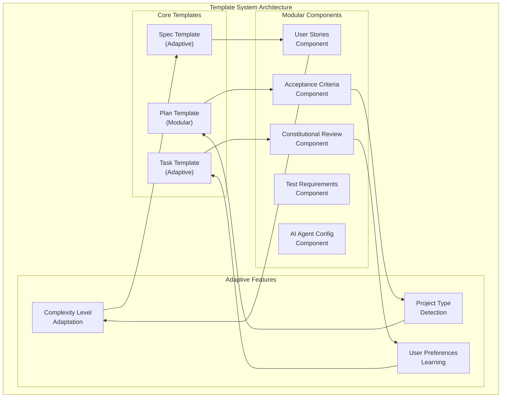

# 🎨 CREATIVE PHASE: TEMPLATE DESIGN
**Specification, Plan, and Task Template Structures**

**Date**: 04.10.2025  
**Phase**: Template Design  
**Complexity**: Level 3 (Intermediate Feature)

## PROBLEM STATEMENT

### Core Challenge
How to design flexible, comprehensive templates that integrate Spec Kit methodologies with Memory Bank workflows while providing both structure and flexibility for different complexity levels and use cases.

### Specific Template Design Challenges
1. **Template Flexibility**: Balancing structure with adaptability for different project types
2. **Constitutional Integration**: Incorporating constitutional principles into templates
3. **Complexity Adaptation**: Templates that scale from Level 1 to Level 4 tasks
4. **AI Agent Compatibility**: Templates that work well with different AI agents
5. **Memory Bank Integration**: Seamless integration with existing Memory Bank file structure

### Requirements
- Flexible template system that adapts to complexity levels
- Constitutional principle integration
- Spec-Driven Development support
- Test-First approach integration
- Multi-AI agent compatibility
- Memory Bank file structure alignment

## OPTIONS ANALYSIS

### Option 1: Fixed Template System
**Description**: Predefined templates with fixed structure for each complexity level and template type.

**Pros**:
- Simple to implement and use
- Consistent structure across projects
- Easy to maintain and update
- Clear expectations for users

**Cons**:
- Limited flexibility for different project types
- May not fit all use cases
- Difficult to customize for specific needs
- Potential for template bloat

**Technical Fit**: High  
**Complexity**: Low  
**Scalability**: Low

### Option 2: Modular Template System
**Description**: Templates composed of modular sections that can be mixed and matched based on needs.

**Pros**:
- High flexibility and customization
- Reusable components
- Easy to extend with new modules
- Adaptable to different project types

**Cons**:
- More complex to implement
- Potential for inconsistent structure
- Higher learning curve for users
- More complex maintenance

**Technical Fit**: Medium  
**Complexity**: High  
**Scalability**: High

### Option 3: Adaptive Template System
**Description**: Templates that automatically adapt based on complexity level, project type, and user preferences.

**Pros**:
- Optimal template for each situation
- Minimal user configuration needed
- Intelligent adaptation
- Best user experience

**Cons**:
- Complex implementation
- Difficult to predict and test
- Potential for unexpected behavior
- High maintenance burden

**Technical Fit**: Medium  
**Complexity**: High  
**Scalability**: Medium

### Option 4: Hybrid Template System
**Description**: Combination of fixed templates for common cases with modular components for customization and adaptive features for complexity levels.

**Pros**:
- Balance of structure and flexibility
- Good for both beginners and experts
- Extensible and maintainable
- Adapts to complexity levels

**Cons**:
- Moderate complexity
- Need to balance different approaches
- Requires careful design
- Some learning curve

**Technical Fit**: High  
**Complexity**: Medium  
**Scalability**: High

## DECISION

**Chosen Option**: Hybrid Template System (Option 4)

**Rationale**:
1. **Balanced Approach**: Provides structure for beginners while allowing customization for experts
2. **Complexity Adaptation**: Naturally scales from Level 1 to Level 4
3. **Flexibility**: Modular components allow for different project types
4. **Maintainability**: Fixed templates for common cases, modular for customization
5. **User Experience**: Progressive complexity that grows with user needs

## TEMPLATE SYSTEM DESIGN

### Template Architecture Overview


### Template Types and Levels

#### 1. Specification Templates
```markdown
# Adaptive Spec Template Structure

## Core Sections (All Levels)
- [ ] User Story
- [ ] Acceptance Criteria
- [ ] Requirements
- [ ] Constitutional Review

## Level-Specific Sections
- Level 1: Basic requirements only
- Level 2: + Non-functional requirements
- Level 3: + Technical constraints, risks
- Level 4: + Architecture considerations, dependencies
```

#### 2. Plan Templates
```markdown
# Modular Plan Template Structure

## Core Modules (Required)
- [ ] Technical Context
- [ ] Constitutional Compliance
- [ ] Implementation Phases

## Optional Modules (Based on Complexity)
- [ ] Architecture Overview (Level 3+)
- [ ] Risk Assessment (Level 2+)
- [ ] Dependencies (Level 3+)
- [ ] Testing Strategy (Level 2+)
- [ ] Performance Considerations (Level 3+)
```

#### 3. Task Templates
```markdown
# Adaptive Task Template Structure

## Core Structure (All Levels)
- [ ] Task Overview
- [ ] Prerequisites
- [ ] Implementation Steps
- [ ] Definition of Done

## Adaptive Sections
- Level 1: Simple checklist
- Level 2: + Testing requirements
- Level 3: + Integration considerations
- Level 4: + Architecture validation
```

## TEMPLATE COMPONENTS

### Constitutional Integration Components

#### Constitutional Review Component
```markdown
## Constitutional Review

### Article Compliance Check
- [ ] Article I: Memory-First Principle
  - [ ] Memory Bank integration planned
  - [ ] Context preservation strategy defined
- [ ] Article II: Spec-Driven Development
  - [ ] Specification reviewed and approved
  - [ ] Executable specifications identified
- [ ] Article III: Test-First Imperative
  - [ ] Test strategy defined
  - [ ] TDD approach planned

### Constitutional Gates
- [ ] VAN Mode: Constitutional validation planned
- [ ] PLAN Mode: Constitutional compliance checked
- [ ] IMPLEMENT Mode: Constitutional principles followed
```

#### Constitutional Validation Component
```markdown
## Constitutional Validation

### Pre-Implementation Check
- [ ] Constitutional principles acknowledged
- [ ] Memory Bank structure valid
- [ ] Spec-Driven approach followed
- [ ] Test-First strategy implemented

### Post-Implementation Check
- [ ] Constitutional compliance verified
- [ ] Learning captured in Memory Bank
- [ ] Documentation updated
- [ ] Constitutional principles reinforced
```

### Spec-Driven Development Components

#### User Story Component
```markdown
## User Story
**As a** [user type]  
**I want** [functionality]  
**So that** [benefit/value]

### Acceptance Criteria
- [ ] [Specific, testable criterion 1]
- [ ] [Specific, testable criterion 2]
- [ ] [Specific, testable criterion 3]

### User Scenarios
#### Scenario 1: [Primary use case]
**Given** [initial context]  
**When** [action is performed]  
**Then** [expected outcome]
```

#### Research Integration Component
```markdown
## Research Integration

### Technology Investigation
- [ ] [Technology 1]: [Research findings]
- [ ] [Technology 2]: [Research findings]
- [ ] [Technology 3]: [Research findings]

### Best Practices Research
- [ ] [Best practice 1]: [Application]
- [ ] [Best practice 2]: [Application]

### Alternative Approaches
- [ ] [Alternative 1]: [Pros/Cons]
- [ ] [Alternative 2]: [Pros/Cons]
- [ ] [Selected approach]: [Rationale]
```

### Test-First Integration Components

#### Test Strategy Component
```markdown
## Test Strategy

### Unit Testing
- [ ] [Component 1]: Unit tests planned
- [ ] [Component 2]: Unit tests planned

### Integration Testing
- [ ] [Integration 1]: Integration tests planned
- [ ] [Integration 2]: Integration tests planned

### Contract Testing (Level 2+)
- [ ] [API 1]: Contract tests planned
- [ ] [API 2]: Contract tests planned

### Test-First Implementation
- [ ] Tests written before implementation
- [ ] Red-Green-Refactor cycle followed
- [ ] Test coverage requirements met
```

### Multi-AI Agent Components

#### AI Agent Configuration Component
```markdown
## AI Agent Configuration

### Primary AI Agent
- [ ] [Agent]: [Configuration]

### Secondary AI Agents
- [ ] [Agent 1]: [Use case]
- [ ] [Agent 2]: [Use case]

### Agent Coordination
- [ ] [Coordination strategy]
- [ ] [Fallback mechanisms]
- [ ] [Response aggregation]
```

## TEMPLATE ADAPTATION LOGIC

### Complexity Level Adaptation
```python
class TemplateAdapter:
    def adapt_spec_template(self, level: int) -> dict:
        sections = {
            'core': ['user_story', 'acceptance_criteria'],
            'level_2': ['non_functional_requirements'],
            'level_3': ['technical_constraints', 'risks'],
            'level_4': ['architecture_considerations', 'dependencies']
        }
        
        template_sections = ['core']
        if level >= 2:
            template_sections.extend(sections['level_2'])
        if level >= 3:
            template_sections.extend(sections['level_3'])
        if level >= 4:
            template_sections.extend(sections['level_4'])
            
        return template_sections
```

### Project Type Detection
```python
class ProjectTypeDetector:
    def detect_project_type(self, project_path: str) -> str:
        # Detect based on file structure, package.json, etc.
        if self.has_web_files(project_path):
            return 'web_application'
        elif self.has_mobile_files(project_path):
            return 'mobile_application'
        elif self.has_api_files(project_path):
            return 'api_service'
        else:
            return 'general'
```

### User Preference Learning
```python
class PreferenceLearner:
    def learn_user_preferences(self, user_history: list) -> dict:
        preferences = {
            'preferred_sections': [],
            'skipped_sections': [],
            'custom_sections': [],
            'complexity_preference': 'auto'
        }
        
        # Analyze user behavior and adapt templates
        for task in user_history:
            self.analyze_task_preferences(task, preferences)
            
        return preferences
```

## TEMPLATE GENERATION SYSTEM

### Template Generator
```python
class TemplateGenerator:
    def generate_spec_template(self, 
                             level: int, 
                             project_type: str, 
                             user_preferences: dict) -> str:
        adapter = TemplateAdapter()
        detector = ProjectTypeDetector()
        
        # Get base template
        base_template = self.get_base_template('spec')
        
        # Adapt for complexity level
        sections = adapter.adapt_spec_template(level)
        
        # Adapt for project type
        project_sections = detector.get_project_sections(project_type)
        
        # Apply user preferences
        final_template = self.apply_preferences(
            base_template, 
            sections, 
            project_sections, 
            user_preferences
        )
        
        return final_template
```

### Template Validation
```python
class TemplateValidator:
    def validate_template(self, template: str, level: int) -> bool:
        required_sections = self.get_required_sections(level)
        
        for section in required_sections:
            if not self.section_exists(template, section):
                return False
                
        return self.validate_constitutional_compliance(template)
```

## IMPLEMENTATION PLAN

### Phase 1: Core Template System
1. Basic template structure
2. Complexity level adaptation
3. Core constitutional integration

### Phase 2: Modular Components
1. Modular component system
2. Project type detection
3. User preference learning

### Phase 3: Advanced Features
1. Multi-AI agent integration
2. Advanced adaptation logic
3. Template validation system

### Phase 4: Polish & Optimization
1. Performance optimization
2. User experience improvements
3. Documentation and examples

## VALIDATION

### Requirements Met:
- [✓] Flexible template system that adapts to complexity levels
- [✓] Constitutional principle integration
- [✓] Spec-Driven Development support
- [✓] Test-First approach integration
- [✓] Multi-AI agent compatibility
- [✓] Memory Bank file structure alignment

### Technical Feasibility: High
- Template system is well-established pattern
- Modular components are straightforward to implement
- Adaptation logic is manageable complexity
- Integration with existing files is direct

### Risk Assessment: Low-Medium
- **Low Risk**: Core template functionality is proven
- **Medium Risk**: Complex adaptation logic needs careful testing
- **Low Risk**: Constitutional integration is additive
- **Low Risk**: Modular system allows incremental development

🎨 CREATIVE CHECKPOINT: Template design complete

## TEMPLATE EXAMPLES

### Level 1 Spec Template (Simplified)
```markdown
# Feature Specification

## User Story
**As a** [user type]  
**I want** [functionality]  
**So that** [benefit/value]

## Acceptance Criteria
- [ ] [Criterion 1]
- [ ] [Criterion 2]

## Constitutional Review
- [ ] Memory Bank integration planned
- [ ] Specification reviewed
```

### Level 3 Spec Template (Enhanced)
```markdown
# Feature Specification

## User Story
[Full user story component]

## Acceptance Criteria
[Detailed acceptance criteria]

## Requirements
### Functional Requirements
- **FR-1**: [Requirement 1]
- **FR-2**: [Requirement 2]

### Non-Functional Requirements
- **NFR-1**: [Performance requirement]
- **NFR-2**: [Security requirement]

## Technical Constraints
- [Constraint 1]
- [Constraint 2]

## Risks & Mitigations
- **Risk 1**: [Description] → **Mitigation**: [Strategy]

## Constitutional Review
[Full constitutional review component]

## Research Integration
[Research findings and technology decisions]

## Test Strategy
[Comprehensive test strategy]
```

🎨🎨🎨 EXITING CREATIVE PHASE - DECISION MADE 🎨🎨🎨

**Template Design Decision**: Hybrid Template System with adaptive complexity levels, modular components for customization, constitutional integration, Spec-Driven Development support, Test-First approach, and multi-AI agent compatibility, providing both structure for beginners and flexibility for experts.
