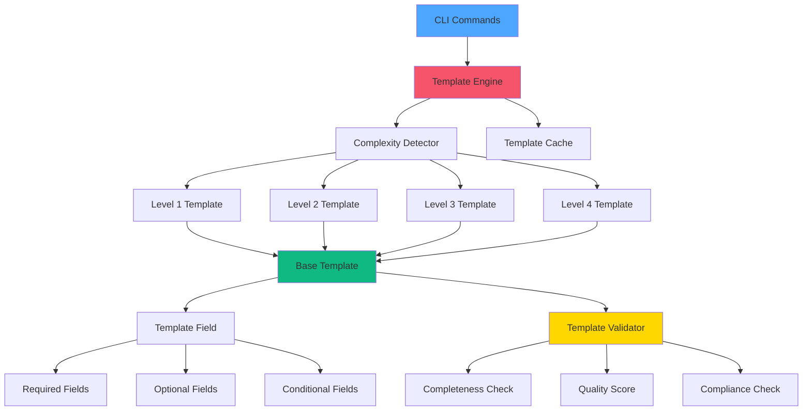
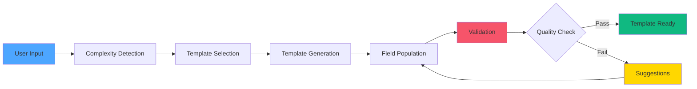
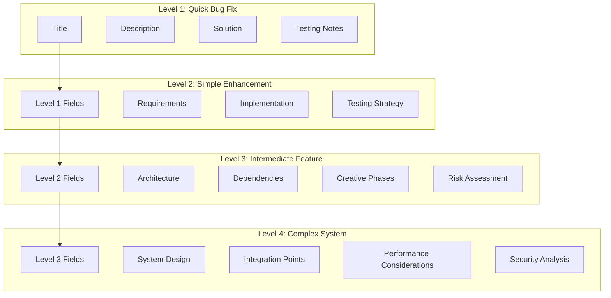

# 🎨 CREATIVE PHASE: Template System Design

**Date**: 04.10.2025  
**Phase**: Phase 2 - Spec-Driven Integration  
**Type**: Architecture Design  
**Complexity**: Level 3 (Intermediate Feature)

## PROBLEM STATEMENT

Необходимо спроектировать систему шаблонов с адаптивной сложностью, которая будет автоматически генерировать подходящие шаблоны спецификаций, планов и задач в зависимости от уровня сложности задачи (Level 1-4). Система должна включать валидацию шаблонов, проверку полноты и систему оценки соответствия, интегрированную с существующим CLI инструментом.

### Ключевые Вызовы:
1. **Управление Сложностью**: Создание шаблонов, которые масштабируются от простых (Level 1) до сложных (Level 4)
2. **Валидация**: Автоматическая проверка полноты и корректности заполненных шаблонов
3. **Интеграция**: Бесшовная интеграция с существующим CLI и Memory Bank workflow
4. **Производительность**: Эффективная обработка и кэширование шаблонов

## OPTIONS ANALYSIS

### Option 1: Статическая Система Шаблонов с Условной Логикой
**Description**: Создание отдельных статических шаблонов для каждого уровня сложности с условной логикой в CLI для выбора подходящего шаблона.

**Pros**:
- Простота реализации
- Предсказуемое поведение
- Легкая отладка и тестирование
- Минимальные зависимости

**Cons**:
- Дублирование кода между шаблонами
- Сложность поддержки при изменении требований
- Ограниченная гибкость для пользовательской настройки
- Статическая структура не адаптируется к новым уровням сложности

**Complexity**: Low  
**Implementation Time**: 20 minutes

### Option 2: Модульная Система с Наследованием Шаблонов
**Description**: Создание базовых шаблонов с системой наследования, где каждый уровень сложности расширяет базовый шаблон дополнительными полями и секциями.

**Pros**:
- Переиспользование кода между уровнями
- Легкое добавление новых уровней сложности
- Четкая иерархия и структура
- Возможность переопределения полей для разных уровней

**Cons**:
- Более сложная архитектура
- Потенциальные конфликты при наследовании
- Требует более тщательного планирования структуры
- Сложнее для понимания новыми пользователями

**Complexity**: Medium  
**Implementation Time**: 35 minutes

### Option 3: Динамическая Система с Генерацией Шаблонов
**Description**: Создание системы, которая динамически генерирует шаблоны на основе правил и конфигурации, с возможностью AI-ассистированной генерации.

**Pros**:
- Максимальная гибкость и адаптивность
- Возможность AI-оптимизации шаблонов
- Легкое добавление новых типов полей
- Потенциальная интеграция с машинным обучением

**Cons**:
- Высокая сложность реализации
- Требует сложной системы правил
- Потенциальные проблемы с производительностью
- Сложность отладки и тестирования
- Зависимость от внешних AI сервисов

**Complexity**: High  
**Implementation Time**: 60 minutes

## DECISION

**Выбранный Подход**: **Option 2: Модульная Система с Наследованием Шаблонов**

### Обоснование Выбора:
1. **Оптимальный Баланс**: Предоставляет хорошую гибкость без чрезмерной сложности
2. **Масштабируемость**: Легко добавлять новые уровни сложности
3. **Поддерживаемость**: Четкая структура упрощает поддержку и обновления
4. **Совместимость**: Хорошо интегрируется с существующей CLI архитектурой
5. **Производительность**: Эффективная обработка без сложных вычислений

### Дополнительные Преимущества:
- Соответствует принципам DRY (Don't Repeat Yourself)
- Обеспечивает консистентность между уровнями
- Позволяет постепенную миграцию существующих шаблонов
- Поддерживает пользовательскую кастомизацию

## IMPLEMENTATION PLAN

### 2.1.1 Архитектура Системы Шаблонов

#### Базовые Компоненты:
```
src/cli/core/templates/
├── base/
│   ├── base_template.py          # Базовый класс шаблона
│   ├── template_field.py         # Класс поля шаблона
│   └── template_validator.py     # Валидатор шаблонов
├── levels/
│   ├── level1_template.py        # Level 1 (Quick Bug Fix)
│   ├── level2_template.py        # Level 2 (Simple Enhancement)
│   ├── level3_template.py        # Level 3 (Intermediate Feature)
│   └── level4_template.py        # Level 4 (Complex System)
├── types/
│   ├── spec_template.py          # Спецификации
│   ├── plan_template.py          # Планы
│   └── task_template.py          # Задачи
└── engine/
    ├── template_engine.py        # Движок генерации шаблонов
    ├── complexity_detector.py    # Детектор сложности
    └── template_cache.py         # Кэширование шаблонов
```

#### Система Наследования:
```python
# Базовый шаблон
class BaseTemplate:
    def __init__(self, complexity_level):
        self.complexity_level = complexity_level
        self.required_fields = []
        self.optional_fields = []
        self.conditional_fields = {}

# Level 1 шаблон
class Level1Template(BaseTemplate):
    def __init__(self):
        super().__init__(1)
        self.required_fields = ['title', 'description', 'solution']
        self.optional_fields = ['testing_notes']

# Level 3 шаблон
class Level3Template(BaseTemplate):
    def __init__(self):
        super().__init__(3)
        self.required_fields = Level1Template().required_fields + [
            'architecture', 'dependencies', 'testing_strategy'
        ]
        self.conditional_fields = {
            'creative_phases': lambda: self.complexity_level >= 3
        }
```

### 2.1.2 Система Валидации

#### Валидационные Правила:
```python
class TemplateValidator:
    def validate_completeness(self, template_data):
        """Проверка полноты заполнения"""
        missing_fields = []
        for field in self.required_fields:
            if not template_data.get(field):
                missing_fields.append(field)
        return len(missing_fields) == 0, missing_fields
    
    def validate_quality(self, template_data):
        """Оценка качества заполнения"""
        score = 0
        total_possible = 100
        
        # Проверка длины описаний
        if len(template_data.get('description', '')) > 50:
            score += 20
        
        # Проверка наличия технических деталей
        if template_data.get('architecture'):
            score += 30
            
        return score, total_possible
```

### 2.1.3 CLI Интеграция

#### Расширенные Команды:
```python
# Команда spec с детекцией сложности
def spec_command(args):
    complexity = detect_complexity(args.description)
    template = TemplateEngine.generate_spec_template(complexity)
    return template

# Команда plan с адаптивным планированием
def plan_command(args):
    complexity = args.complexity or detect_complexity_from_spec()
    template = TemplateEngine.generate_plan_template(complexity)
    return template
```

## VISUALIZATION

### Диаграмма Архитектуры Системы Шаблонов:



### Диаграмма Потока Данных:



### Структура Шаблонов по Уровням:



## 🎨 CREATIVE CHECKPOINT: Template System Design Complete

### Ключевые Решения:
1. **Модульная Архитектура**: Использование наследования для переиспользования кода
2. **Адаптивная Сложность**: Автоматическое определение уровня сложности и генерация соответствующих шаблонов
3. **Комплексная Валидация**: Система проверки полноты, качества и соответствия
4. **Эффективное Кэширование**: Кэширование шаблонов для улучшения производительности

### Технические Детали:
- **Базовые Классы**: Абстрактные классы для шаблонов и полей
- **Система Наследования**: Иерархия от базового шаблона к специфичным уровням
- **Валидационные Правила**: Автоматическая проверка и оценка качества
- **CLI Интеграция**: Бесшовная интеграция с существующими командами

### Ожидаемые Результаты:
- Автоматическая генерация подходящих шаблонов
- Улучшенное качество спецификаций и планов
- Сокращение времени на создание документации
- Повышенная консистентность между задачами разных уровней сложности

---

🎨🎨🎨 EXITING CREATIVE PHASE - TEMPLATE SYSTEM DESIGN DECISION MADE 🎨🎨🎨
