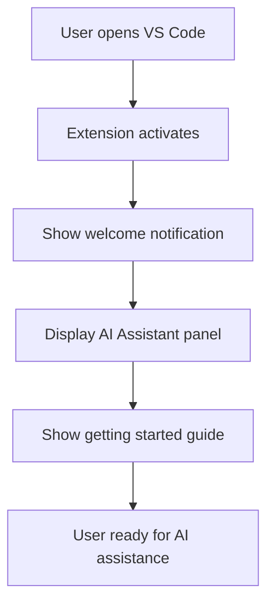
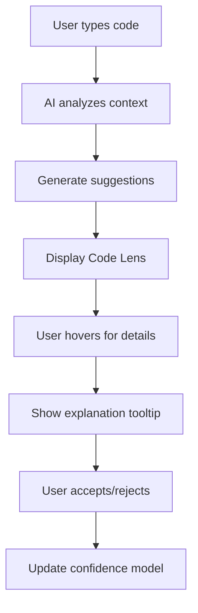
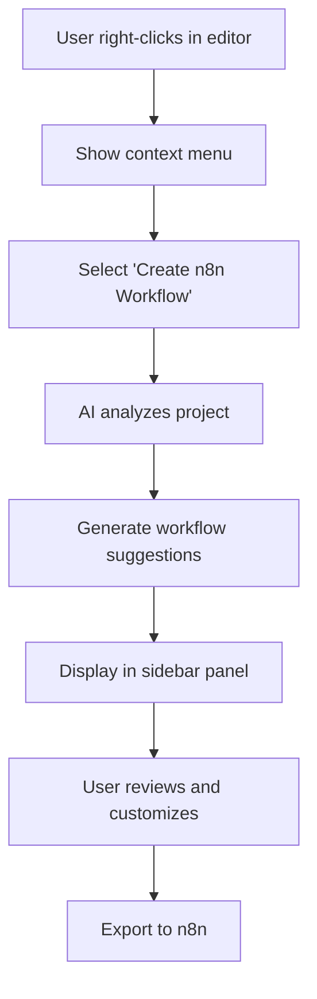

# CREATIVE PHASE: VS CODE EXTENSION UI/UX DESIGN

## 📌 CREATIVE PHASE START: VS Code Extension Interface
━━━━━━━━━━━━━━━━━━━━━━━━━━━━━━━

## 1️⃣ PROBLEM
**Description**: Design intuitive VS Code extension interface for RAG-powered code assistance
**Requirements**: 
- Seamless integration with VS Code UI patterns
- Real-time AI suggestions and feedback
- Context-aware code assistance
- Minimal cognitive load for developers
- Privacy-first local processing indicators
- Keyboard shortcuts and command palette integration

**Constraints**: 
- VS Code Extension API limitations
- Performance requirements (<100ms response time)
- Memory usage optimization
- Cross-platform compatibility (Windows focus)
- Accessibility compliance (WCAG 2.1 AA)

## 2️⃣ OPTIONS

**Option A: Sidebar Panel Interface** - Dedicated sidebar panel for AI interactions
**Option B: Inline Code Lens Integration** - Contextual suggestions directly in editor
**Option C: Hybrid Overlay System** - Combination of sidebar and inline elements

## 3️⃣ ANALYSIS

| Criterion | Sidebar Panel | Code Lens | Hybrid |
|-----------|---------------|-----------|--------|
| Developer Workflow | ⭐⭐⭐ | ⭐⭐⭐⭐⭐ | ⭐⭐⭐⭐ |
| Context Awareness | ⭐⭐ | ⭐⭐⭐⭐⭐ | ⭐⭐⭐⭐ |
| Screen Real Estate | ⭐⭐ | ⭐⭐⭐⭐⭐ | ⭐⭐⭐ |
| Discoverability | ⭐⭐⭐⭐ | ⭐⭐ | ⭐⭐⭐⭐⭐ |
| Performance | ⭐⭐⭐⭐ | ⭐⭐ | ⭐⭐⭐ |
| Implementation Complexity | ⭐⭐⭐⭐⭐ | ⭐⭐ | ⭐⭐ |

**Key Insights**:
- Code Lens provides best context awareness but limited discoverability
- Sidebar offers excellent discoverability but takes screen space
- Hybrid approach balances benefits but increases complexity

## 4️⃣ DECISION
**Selected**: Option C: Hybrid Overlay System with Smart Context Switching
**Rationale**: Best balance of context awareness, discoverability, and developer workflow integration

## 5️⃣ IMPLEMENTATION NOTES

### Core UI Components:

#### 1. AI Assistant Sidebar Panel
```typescript
// Main sidebar panel structure
interface AISidebarPanel {
  header: {
    title: "RAG Assistant"
    status: "connected" | "processing" | "error"
    localIndicator: boolean
  }
  tabs: {
    suggestions: AISuggestionTab
    context: ContextTab
    workflows: WorkflowTab
    settings: SettingsTab
  }
  footer: {
    model: string
    confidence: number
    processingTime: number
  }
}
```

#### 2. Code Lens Integration
```typescript
// Inline code assistance
interface CodeLensProvider {
  provideCodeLenses(document: TextDocument): CodeLens[]
  resolveCodeLens(codeLens: CodeLens): CodeLens
}

// Code lens types
enum CodeLensType {
  SUGGESTION = "suggestion",
  EXPLANATION = "explanation", 
  WORKFLOW = "workflow",
  OPTIMIZATION = "optimization"
}
```

#### 3. Context-Aware Tooltips
```typescript
// Hover provider for contextual help
interface AIHoverProvider {
  provideHover(document: TextDocument, position: Position): Hover
  getContextualSuggestions(position: Position): Suggestion[]
  getCodeExplanation(code: string): string
}
```

### Visual Design (Following Style Guide):

#### Color Scheme Application:
- **Primary Blue** (`--primary-500`): Main actions and highlights
- **AI Purple** (`--ai-500`): AI-specific elements and processing
- **Local Teal** (`--local-500`): Privacy/local processing indicators
- **Success Green** (`--success-500`): Confirmed suggestions and completions
- **Warning Orange** (`--warning-500`): Cautionary suggestions
- **Error Red** (`--error-500`): Errors and rejected suggestions

#### Typography:
- **Primary Font**: Inter for UI elements
- **Code Font**: JetBrains Mono for code suggestions
- **Font Sizes**: 
  - Headers: `--text-lg` (18px)
  - Body: `--text-sm` (14px)
  - Code: `--code-sm` (14px)
  - Labels: `--text-xs` (12px)

#### Component Styling:
```css
/* AI Sidebar Panel */
.ai-sidebar {
  background: var(--neutral-50);
  border-left: 1px solid var(--neutral-200);
  font-family: var(--font-primary);
}

.ai-sidebar-header {
  background: linear-gradient(135deg, var(--ai-50), var(--primary-50));
  border-bottom: 1px solid var(--ai-200);
  padding: var(--space-4);
}

/* Code Lens Styling */
.code-lens-suggestion {
  color: var(--ai-600);
  font-family: var(--font-code);
  font-size: var(--text-sm);
  cursor: pointer;
}

.code-lens-suggestion:hover {
  color: var(--ai-500);
  background: var(--ai-50);
}

/* Confidence Indicator */
.confidence-indicator {
  display: inline-flex;
  align-items: center;
  gap: var(--space-1);
  padding: var(--space-1) var(--space-2);
  background: var(--success-50);
  border: 1px solid var(--success-200);
  border-radius: var(--radius-md);
  font-size: var(--text-xs);
  color: var(--success-700);
}
```

### User Experience Flow:

#### 1. Initial Setup & Discovery


#### 2. Code Assistance Flow


#### 3. Workflow Creation Flow


### Accessibility Features:

#### 1. Keyboard Navigation
- **Tab Navigation**: Full keyboard support for all UI elements
- **Shortcuts**: 
  - `Ctrl+Shift+A`: Open AI Assistant panel
  - `Ctrl+Shift+S`: Show suggestions
  - `Ctrl+Shift+W`: Create workflow
  - `Escape`: Close AI panels

#### 2. Screen Reader Support
- **ARIA Labels**: All interactive elements properly labeled
- **Live Regions**: Status updates announced to screen readers
- **Semantic HTML**: Proper heading structure and landmarks

#### 3. Visual Accessibility
- **High Contrast**: Support for high contrast themes
- **Focus Indicators**: Clear focus states for all elements
- **Color Independence**: Information not conveyed by color alone

### Performance Optimizations:

#### 1. Lazy Loading
- Load AI suggestions only when needed
- Defer heavy computations until user interaction
- Cache frequently accessed data

#### 2. Debounced Requests
- Debounce AI requests to prevent excessive API calls
- Implement request cancellation for outdated queries
- Use request queuing for better resource management

#### 3. Memory Management
- Clean up unused UI components
- Implement proper disposal patterns
- Monitor memory usage and optimize as needed

### Integration Points:

#### 1. VS Code APIs Used
- **Webview API**: For sidebar panel content
- **CodeLens API**: For inline suggestions
- **Hover API**: For contextual help
- **Command API**: For command palette integration
- **Status Bar API**: For status indicators
- **Tree View API**: For workflow management

#### 2. Extension Configuration
```json
{
  "contributes": {
    "commands": [
      {
        "command": "rag-assistant.openPanel",
        "title": "Open RAG Assistant",
        "category": "RAG"
      },
      {
        "command": "rag-assistant.createWorkflow", 
        "title": "Create n8n Workflow",
        "category": "RAG"
      }
    ],
    "views": {
      "explorer": [
        {
          "id": "rag-workflows",
          "name": "AI Workflows",
          "when": "rag-assistant.enabled"
        }
      ]
    },
    "menus": {
      "editor/context": [
        {
          "command": "rag-assistant.createWorkflow",
          "when": "editorTextFocus",
          "group": "rag-assistant"
        }
      ]
    }
  }
}
```

━━━━━━━━━━━━━━━━━━━━━━━━━━━━━━━
## 📌 CREATIVE PHASE END: VS Code UI/UX Design Complete

## ✅ VERIFICATION CHECKLIST
- [x] Problem clearly defined
- [x] Multiple options considered (3)
- [x] Decision made with rationale
- [x] Implementation guidance provided
- [x] Style guide adherence verified
- [x] Accessibility requirements addressed
- [x] Performance considerations documented
- [x] VS Code API integration planned
- [x] User experience flows designed
- [x] Component specifications created
