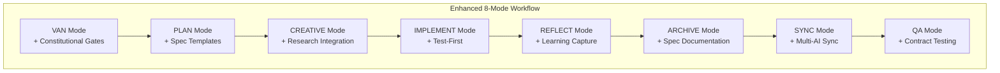
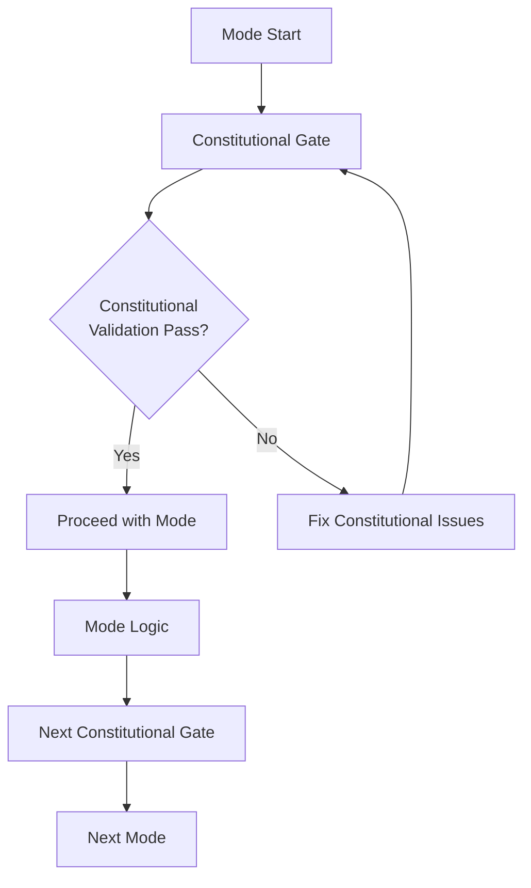
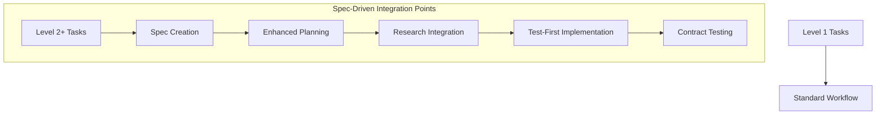

# 🎨 CREATIVE PHASE: WORKFLOW DESIGN
**Enhanced 8-Mode Workflow with Spec-Driven Principles**

**Date**: 04.10.2025  
**Phase**: Workflow Design  
**Complexity**: Level 3 (Intermediate Feature)

## PROBLEM STATEMENT

### Core Challenge
How to enhance the existing 8-mode workflow (VAN → PLAN → CREATIVE → IMPLEMENT → REFLECT → ARCHIVE → SYNC → QA) to incorporate Spec Kit methodologies while maintaining workflow efficiency and user experience.

### Specific Workflow Challenges
1. **Constitutional Integration**: Where and how to insert constitutional validation gates
2. **Spec-Driven Flow**: How to integrate specification creation and validation into existing modes
3. **Template Integration**: When and how to use Spec-Driven templates
4. **Multi-AI Agent Coordination**: How to manage different AI agents across modes
5. **Enhanced QA**: How to strengthen QA mode with Test-First principles

### Requirements
- Maintain existing 8-mode workflow structure
- Add constitutional validation at appropriate points
- Integrate Spec-Driven Development naturally
- Preserve mode transition logic
- Enhance each mode with new capabilities

## OPTIONS ANALYSIS

### Option 1: Minimal Integration - Constitutional Gates Only
**Description**: Add constitutional validation gates to existing modes without changing workflow structure.

**Pros**:
- Minimal disruption to existing workflow
- Easy to implement and test
- Low risk of breaking existing functionality
- Quick to deploy

**Cons**:
- Limited Spec Kit methodology integration
- Misses opportunity for deeper workflow enhancement
- May feel like add-on rather than integrated solution
- Doesn't leverage full potential of Spec Kit approaches

**Technical Fit**: High  
**Complexity**: Low  
**Scalability**: Medium

### Option 2: Enhanced Mode Integration
**Description**: Enhance each existing mode with Spec Kit capabilities while maintaining mode sequence.

**Pros**:
- Natural integration of methodologies
- Each mode becomes more powerful
- Maintains familiar workflow structure
- Progressive enhancement approach

**Cons**:
- Some modes may become complex
- Need to carefully balance old and new functionality
- Potential for mode bloat
- Requires careful UX design

**Technical Fit**: High  
**Complexity**: Medium  
**Scalability**: High

### Option 3: Hybrid Workflow with Spec-Driven Branch
**Description**: Create parallel Spec-Driven workflow that can be activated for Level 2+ tasks.

**Pros**:
- Users can choose workflow type
- Clean separation of methodologies
- Full Spec Kit implementation possible
- Flexible user experience

**Cons**:
- Dual workflow complexity
- User confusion about which to use
- Increased maintenance burden
- Potential for feature duplication

**Technical Fit**: Medium  
**Complexity**: High  
**Scalability**: Medium

### Option 4: Unified Enhanced Workflow
**Description**: Completely redesign workflow to seamlessly integrate both methodologies into a single, enhanced flow.

**Pros**:
- Single, unified workflow
- Optimal user experience
- Full integration of methodologies
- Clean, maintainable design

**Cons**:
- Significant changes to existing workflow
- High risk of breaking existing functionality
- Complex implementation
- Requires extensive user retraining

**Technical Fit**: High  
**Complexity**: High  
**Scalability**: High

## DECISION

**Chosen Option**: Enhanced Mode Integration (Option 2)

**Rationale**:
1. **Natural Integration**: Enhances existing modes rather than replacing them
2. **User Familiarity**: Maintains familiar workflow structure users already know
3. **Progressive Enhancement**: Allows gradual adoption of new capabilities
4. **Balanced Complexity**: Provides benefits without overwhelming complexity
5. **Implementation Feasibility**: Manageable implementation within existing architecture

## ENHANCED WORKFLOW DESIGN

### Mode Enhancement Overview


### Detailed Mode Enhancements

#### 1. VAN Mode Enhancement
**New Capabilities**:
- Constitutional validation checkpoints
- Multi-AI agent initialization
- Enhanced complexity determination with Spec Kit considerations

**Constitutional Gates**:
```
✓ CONSTITUTIONAL VALIDATION: VAN Mode
- Memory Bank structure valid? [YES/NO]
- Constitutional principles acknowledged? [YES/NO]
- AI agent compatibility verified? [YES/NO]

→ If all YES: Proceed to PLAN mode
→ If any NO: Address constitutional issues
```

#### 2. PLAN Mode Enhancement
**New Capabilities**:
- Spec-Driven planning with templates
- Constitutional compliance checking
- Enhanced technology validation with research integration

**Enhanced Planning Process**:
```
PLAN Mode Enhanced Flow:
1. Constitutional Validation
2. Specification Creation (if Level 2+)
3. Enhanced Planning with Spec Templates
4. Constitutional Compliance Check
5. Technology Validation with Research
6. Creative Phase Identification
```

#### 3. CREATIVE Mode Enhancement
**New Capabilities**:
- Research-driven design decisions
- Technology investigation integration
- Enhanced documentation with Spec Kit templates

**Research Integration**:
```markdown
CREATIVE Mode Enhanced:
- Automatic technology research
- Best practices investigation
- Alternative approach analysis
- Design decision documentation
- Constitutional principle alignment
```

#### 4. IMPLEMENT Mode Enhancement
**New Capabilities**:
- Mandatory Test-First Development for Level 2+
- Contract testing integration
- Enhanced progress tracking with Spec Kit metrics

**Test-First Implementation**:
```
IMPLEMENT Mode Enhanced:
1. Contract Test Creation
2. Unit Test Implementation
3. Core Feature Development
4. Integration Testing
5. Contract Test Validation
```

#### 5. REFLECT Mode Enhancement
**New Capabilities**:
- Enhanced learning capture
- Spec Kit methodology reflection
- Constitutional principle evaluation

#### 6. ARCHIVE Mode Enhancement
**New Capabilities**:
- Spec-Driven documentation
- Constitutional decision capture
- Multi-AI agent learning preservation

#### 7. SYNC Mode Enhancement
**New Capabilities**:
- Multi-AI agent synchronization
- Enhanced documentation updates
- Constitutional compliance documentation

#### 8. QA Mode Enhancement
**New Capabilities**:
- Contract testing validation
- Constitutional compliance verification
- Enhanced technical validation

## WORKFLOW TRANSITION LOGIC

### Constitutional Gates Integration


### Spec-Driven Integration Points


## CONFIGURATION SYSTEM

### Workflow Configuration
```typescript
interface WorkflowConfig {
  constitutionalGates: {
    enabled: boolean;
    strictness: 'strict' | 'relaxed' | 'disabled';
    modes: string[]; // Which modes have gates
  };
  specDrivenMode: {
    enabled: boolean;
    minLevel: number; // Minimum level for Spec-Driven
    templates: string[];
  };
  testFirst: {
    enabled: boolean;
    minLevel: number;
    contractTesting: boolean;
  };
  multiAI: {
    enabled: boolean;
    agents: string[];
    coordination: 'sequential' | 'parallel' | 'adaptive';
  };
}
```

### Mode-Specific Enhancements
```typescript
interface ModeEnhancement {
  mode: string;
  constitutionalGates: boolean;
  specDrivenTemplates: boolean;
  researchIntegration: boolean;
  testFirst: boolean;
  multiAISupport: boolean;
}
```

## IMPLEMENTATION SEQUENCE

### Phase 1: Constitutional Gates
1. Add constitutional validation to VAN mode
2. Add constitutional checkpoints to PLAN mode
3. Add constitutional compliance to CREATIVE mode

### Phase 2: Spec-Driven Integration
1. Integrate spec templates into PLAN mode
2. Add research integration to CREATIVE mode
3. Enhance IMPLEMENT mode with Test-First

### Phase 3: Multi-AI Enhancement
1. Add multi-AI agent support to VAN mode
2. Enhance SYNC mode with multi-AI coordination
3. Update QA mode with enhanced validation

### Phase 4: Full Integration
1. Complete all mode enhancements
2. Add configuration system
3. Implement workflow coordination

## VALIDATION

### Requirements Met:
- [✓] Maintain existing 8-mode workflow structure
- [✓] Add constitutional validation at appropriate points
- [✓] Integrate Spec-Driven Development naturally
- [✓] Preserve mode transition logic
- [✓] Enhance each mode with new capabilities

### Technical Feasibility: High
- All enhancements build on existing mode infrastructure
- Constitutional gates are additive, not replacing existing logic
- Spec-Driven templates integrate naturally with existing planning
- Multi-AI support extends existing GitHub Copilot integration

### Risk Assessment: Low-Medium
- **Low Risk**: Incremental enhancement approach
- **Low Risk**: Backward compatibility maintained
- **Medium Risk**: Configuration complexity needs careful design
- **Low Risk**: Gradual rollout possible

🎨 CREATIVE CHECKPOINT: Workflow design complete

## USER EXPERIENCE CONSIDERATIONS

### Gradual Adoption Path
1. **Level 1**: Constitutional gates disabled by default
2. **Level 2**: Spec-Driven templates recommended but optional
3. **Level 3**: Enhanced QA with contract testing
4. **Level 4**: Full multi-AI agent coordination

### Configuration Guidance
```markdown
# Workflow Configuration Guide

## For New Users:
- Start with default configuration
- Gradually enable features as comfort increases
- Use guided setup for constitutional gates

## For Existing Users:
- Maintain current workflow by default
- Opt-in to new features
- Gradual migration path provided
```

🎨🎨🎨 EXITING CREATIVE PHASE - DECISION MADE 🎨🎨🎨

**Workflow Decision**: Enhanced Mode Integration with constitutional gates, Spec-Driven templates, research integration, and multi-AI support while maintaining the familiar 8-mode workflow structure.
