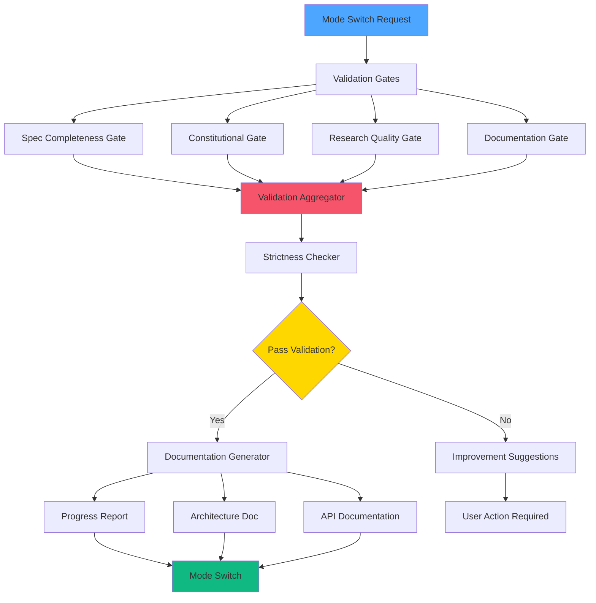
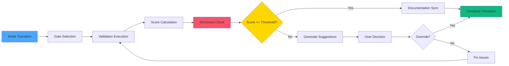
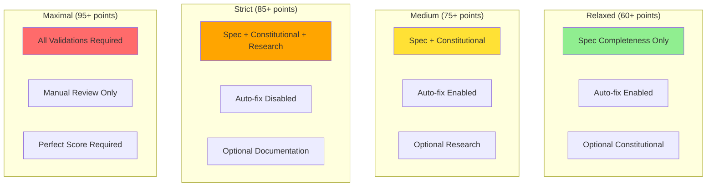
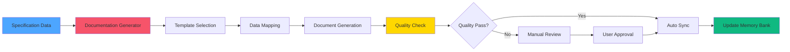
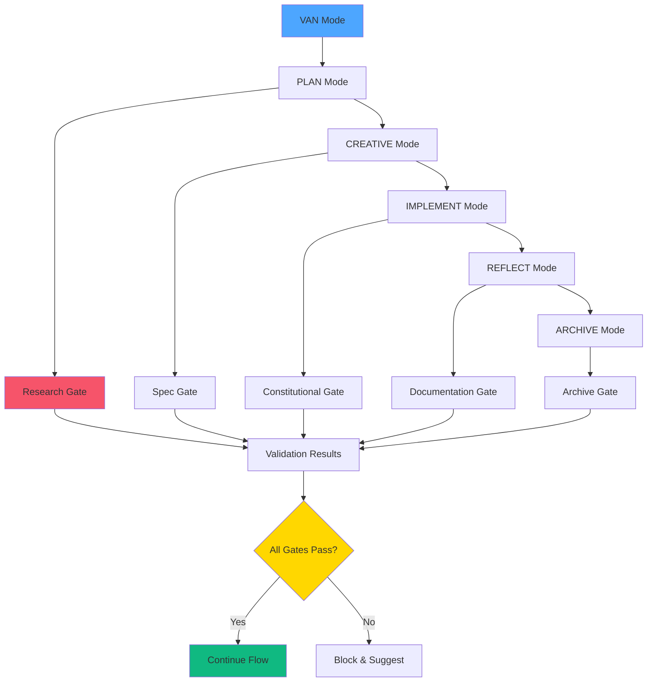

# 🎨 CREATIVE PHASE: Workflow Integration Design

**Date**: 04.10.2025  
**Phase**: Phase 2 - Spec-Driven Integration  
**Type**: Architecture Design  
**Complexity**: Level 3 (Intermediate Feature)

## PROBLEM STATEMENT

Необходимо спроектировать интеграцию Spec-Driven валидационных ворот в существующий 8-режимный workflow Memory Bank, обеспечив бесшовное переключение между режимами с конституционной проверкой соответствия. Система должна включать автоматическую генерацию документации из спецификаций и улучшенную проверку качества без нарушения существующих процессов.

### Ключевые Вызовы:
1. **Обратная Совместимость**: Сохранение существующего workflow без нарушения
2. **Валидационные Ворота**: Интеграция проверок без замедления процесса
3. **Автоматизация Документации**: Генерация документов из спецификаций
4. **Конституционное Соответствие**: Проверка соответствия принципам на каждом этапе

## OPTIONS ANALYSIS

### Option 1: Опциональные Валидационные Ворота
**Description**: Добавление опциональных проверок на каждом переходе между режимами с возможностью их отключения для сохранения гибкости.

**Pros**:
- Полная обратная совместимость
- Гибкость для пользователей
- Постепенное внедрение
- Минимальный риск нарушения существующих процессов

**Cons**:
- Ограниченная принудительная дисциплина
- Потенциальное игнорирование проверок
- Сложность управления конфигурацией
- Неравномерное применение стандартов

**Complexity**: Low  
**Implementation Time**: 20 minutes

### Option 2: Обязательные Валидационные Ворота с Настраиваемой Строгостью
**Description**: Обязательные проверки на критических переходах с настраиваемыми уровнями строгости для разных типов задач.

**Pros**:
- Обеспечивает дисциплину разработки
- Гибкость через настройку строгости
- Четкие стандарты качества
- Автоматическая проверка соответствия

**Cons**:
- Потенциальное замедление процесса
- Сложность настройки уровней строгости
- Риск раздражения пользователей
- Требует тщательного тестирования

**Complexity**: Medium  
**Implementation Time**: 35 minutes

### Option 3: Интеллектуальные Адаптивные Ворота
**Description**: AI-ассистированная система, которая автоматически определяет необходимость и строгость валидации на основе контекста задачи и истории.

**Pros**:
- Интеллектуальная адаптация к контексту
- Оптимальный баланс качества и скорости
- Обучение на основе пользовательского поведения
- Минимизация ложных срабатываний

**Cons**:
- Высокая сложность реализации
- Зависимость от AI и машинного обучения
- Потенциальная непредсказуемость
- Требует значительного времени на разработку

**Complexity**: High  
**Implementation Time**: 60 minutes

## DECISION

**Выбранный Подход**: **Option 2: Обязательные Валидационные Ворота с Настраиваемой Строгостью**

### Обоснование Выбора:
1. **Баланс Дисциплины и Гибкости**: Обеспечивает качество без чрезмерной жесткости
2. **Конституционное Соответствие**: Автоматическая проверка принципов разработки
3. **Настраиваемость**: Разные уровни строгости для разных типов задач
4. **Предсказуемость**: Четкие правила и ожидания для пользователей
5. **Постепенное Внедрение**: Возможность настройки строгости по мере адаптации

### Дополнительные Преимущества:
- Улучшает качество спецификаций и планов
- Обеспечивает консистентность в команде
- Снижает количество ошибок на поздних стадиях
- Поддерживает принципы Spec-Driven разработки

## IMPLEMENTATION PLAN

### 2.3.1 Архитектура Валидационных Ворот

#### Основные Компоненты:
```
src/cli/core/workflow/
├── gates/
│   ├── validation_gate.py         # Базовый класс валидационных ворот
│   ├── spec_completeness_gate.py  # Проверка полноты спецификации
│   ├── constitutional_gate.py     # Конституционная проверка
│   ├── research_gate.py           # Проверка исследований
│   └── documentation_gate.py      # Проверка документации
├── validators/
│   ├── workflow_validator.py      # Валидатор workflow
│   ├── mode_transition_validator.py # Валидатор переходов
│   └── compliance_validator.py    # Валидатор соответствия
├── automation/
│   ├── doc_generator.py           # Генератор документации
│   ├── progress_reporter.py       # Генератор отчетов
│   └── sync_manager.py            # Менеджер синхронизации
└── configuration/
    ├── strictness_config.py       # Конфигурация строгости
    ├── gate_config.py             # Конфигурация ворот
    └── workflow_config.py         # Конфигурация workflow
```

#### Система Валидационных Ворот:
```python
class ValidationGate:
    def __init__(self, strictness_level="medium"):
        self.strictness_level = strictness_level
        self.validation_rules = self.load_validation_rules()
    
    def validate_transition(self, from_mode, to_mode, context):
        """Валидация перехода между режимами"""
        validation_results = {
            'spec_completeness': self.check_spec_completeness(context),
            'constitutional_compliance': self.check_constitutional_compliance(context),
            'research_quality': self.check_research_quality(context),
            'documentation_quality': self.check_documentation_quality(context)
        }
        
        overall_score = self.calculate_score(validation_results)
        return self.passes_validation(overall_score, self.strictness_level), validation_results
```

### 2.3.2 Настраиваемая Строгость

#### Уровни Строгости:
```python
class StrictnessConfig:
    STRICTNESS_LEVELS = {
        'relaxed': {
            'min_score': 60,
            'required_checks': ['spec_completeness'],
            'optional_checks': ['constitutional_compliance'],
            'auto_fix': True
        },
        'medium': {
            'min_score': 75,
            'required_checks': ['spec_completeness', 'constitutional_compliance'],
            'optional_checks': ['research_quality'],
            'auto_fix': True
        },
        'strict': {
            'min_score': 85,
            'required_checks': ['spec_completeness', 'constitutional_compliance', 'research_quality'],
            'optional_checks': ['documentation_quality'],
            'auto_fix': False
        },
        'maximal': {
            'min_score': 95,
            'required_checks': ['spec_completeness', 'constitutional_compliance', 'research_quality', 'documentation_quality'],
            'optional_checks': [],
            'auto_fix': False
        }
    }
```

### 2.3.3 Автоматическая Генерация Документации

#### Documentation Generator:
```python
class DocumentationGenerator:
    def __init__(self, template_engine, spec_converter):
        self.template_engine = template_engine
        self.spec_converter = spec_converter
    
    def generate_from_spec(self, spec_data, doc_type):
        """Генерация документации из спецификации"""
        if doc_type == 'progress_report':
            return self.generate_progress_report(spec_data)
        elif doc_type == 'architecture_doc':
            return self.generate_architecture_doc(spec_data)
        elif doc_type == 'api_doc':
            return self.generate_api_doc(spec_data)
        else:
            return self.generate_generic_doc(spec_data, doc_type)
    
    def auto_sync_documentation(self, spec_data):
        """Автоматическая синхронизация документации"""
        # Обновление существующих документов
        # Создание новых документов при необходимости
        # Проверка консистентности
        pass
```

### 2.3.4 Интеграция с Существующими Режимами

#### Enhanced Mode Switching:
```python
class EnhancedModeSwitcher:
    def __init__(self, validation_gates, doc_generator):
        self.validation_gates = validation_gates
        self.doc_generator = doc_generator
    
    def switch_mode(self, from_mode, to_mode, context):
        """Улучшенное переключение режимов с валидацией"""
        # 1. Проверка валидационных ворот
        validation_result = self.validation_gates.validate_transition(from_mode, to_mode, context)
        
        if not validation_result['passed']:
            return self.handle_validation_failure(validation_result, context)
        
        # 2. Автоматическая генерация документации
        if to_mode in ['implement', 'reflect', 'archive']:
            self.doc_generator.auto_sync_documentation(context.get('spec_data'))
        
        # 3. Переключение режима
        return self.execute_mode_switch(from_mode, to_mode, context)
    
    def handle_validation_failure(self, validation_result, context):
        """Обработка неудачной валидации"""
        suggestions = self.generate_improvement_suggestions(validation_result)
        return {
            'status': 'validation_failed',
            'suggestions': suggestions,
            'can_override': self.can_override_validation(validation_result)
        }
```

## VISUALIZATION

### Диаграмма Архитектуры Workflow Integration:



### Диаграмма Потока Валидации:



### Уровни Строгости:



### Автоматическая Генерация Документации:



### Интеграция с Режимами:



## 🎨 CREATIVE CHECKPOINT: Workflow Integration Design Complete

### Ключевые Решения:
1. **Обязательные Валидационные Ворота**: Обеспечение качества с настраиваемой строгостью
2. **Многоуровневая Строгость**: 4 уровня от relaxed до maximal для разных потребностей
3. **Автоматическая Документация**: Генерация и синхронизация документов из спецификаций
4. **Бесшовная Интеграция**: Сохранение существующего workflow с улучшениями

### Технические Детали:
- **Валидационные Ворота**: Проверка на каждом критическом переходе
- **Система Строгости**: Настраиваемые уровни с разными требованиями
- **Автоматизация**: Генерация прогресс-отчетов, архитектурной документации
- **Конституционное Соответствие**: Автоматическая проверка принципов

### Ожидаемые Результаты:
- Улучшенное качество спецификаций и планов
- Автоматическая генерация актуальной документации
- Снижение ошибок на поздних стадиях разработки
- Поддержка дисциплины Spec-Driven разработки

---

🎨🎨🎨 EXITING CREATIVE PHASE - WORKFLOW INTEGRATION DESIGN DECISION MADE 🎨🎨🎨
