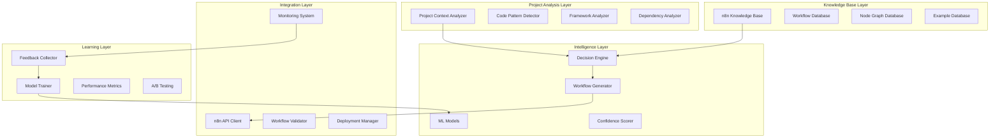
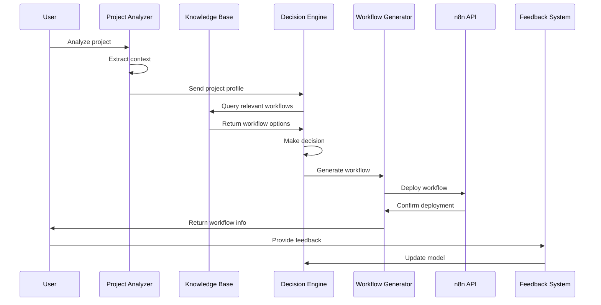

# 🏗️ DETAILED ARCHITECTURE PLAN: Intelligent n8n Workflow Creation System

## System Architecture Overview



## Component Details

### 1. Project Context Analyzer
**Purpose**: Extract comprehensive project context
**Input**: Project directory path
**Output**: Structured project profile
**Key Features**:
- Language detection (Python, JavaScript, TypeScript, etc.)
- Framework identification (React, Vue, Django, FastAPI, etc.)
- Dependency analysis (package.json, requirements.txt, etc.)
- Code pattern detection (MVC, microservices, etc.)
- Architecture analysis (monolith, distributed, etc.)

**Implementation**:
```python
class ProjectContextAnalyzer:
    def __init__(self):
        self.language_detectors = {
            'python': PythonDetector(),
            'javascript': JavaScriptDetector(),
            'typescript': TypeScriptDetector(),
            'java': JavaDetector(),
            'go': GoDetector()
        }
        self.framework_analyzers = {
            'react': ReactAnalyzer(),
            'vue': VueAnalyzer(),
            'django': DjangoAnalyzer(),
            'fastapi': FastAPIAnalyzer()
        }
    
    def analyze_project(self, project_path: str) -> ProjectProfile:
        profile = ProjectProfile()
        
        # Detect primary language
        profile.language = self.detect_primary_language(project_path)
        
        # Identify frameworks
        profile.frameworks = self.identify_frameworks(project_path, profile.language)
        
        # Analyze dependencies
        profile.dependencies = self.analyze_dependencies(project_path)
        
        # Detect code patterns
        profile.patterns = self.detect_code_patterns(project_path)
        
        # Analyze architecture
        profile.architecture = self.analyze_architecture(project_path)
        
        return profile
```

### 2. n8n Knowledge Base
**Purpose**: Store and retrieve n8n capabilities
**Data Sources**:
- Official n8n documentation
- Community workflows
- API specifications
- Node descriptions and parameters

**Structure**:
- Nodes catalog with capabilities
- Workflow templates library
- Best practices database
- Integration patterns

**Implementation**:
```python
class N8nKnowledgeBase:
    def __init__(self, db_connection):
        self.db = db_connection
        self.node_catalog = NodeCatalog()
        self.workflow_templates = WorkflowTemplateLibrary()
        self.best_practices = BestPracticesDB()
    
    def get_suitable_nodes(self, workflow_purpose: str, context: ProjectProfile) -> List[Node]:
        """Find nodes suitable for specific workflow purpose"""
        suitable_nodes = []
        
        for node in self.node_catalog.get_all_nodes():
            if self.is_node_suitable(node, workflow_purpose, context):
                suitable_nodes.append(node)
        
        return self.rank_nodes_by_relevance(suitable_nodes, context)
    
    def get_workflow_examples(self, workflow_type: str) -> List[WorkflowExample]:
        """Get example workflows for specific type"""
        return self.workflow_templates.get_examples(workflow_type)
```

### 3. Decision Engine
**Purpose**: Make intelligent decisions about workflow creation
**Components**:
- **Context Matcher**: Match project context with suitable workflows
- **Need Predictor**: Predict what workflows the project needs
- **Priority Ranker**: Rank workflow suggestions by importance
- **Confidence Calculator**: Calculate confidence in recommendations

**Implementation**:
```python
class DecisionEngine:
    def __init__(self, ml_model, knowledge_base):
        self.ml_model = ml_model
        self.knowledge_base = knowledge_base
        self.confidence_calculator = ConfidenceCalculator()
    
    def decide_workflow_needs(self, project_profile: ProjectProfile) -> List[WorkflowDecision]:
        decisions = []
        
        # Extract features for ML model
        features = self.extract_features(project_profile)
        
        # Get ML predictions
        predictions = self.ml_model.predict(features)
        
        # Process each prediction
        for prediction in predictions:
            decision = WorkflowDecision(
                workflow_type=prediction['type'],
                confidence=prediction['confidence'],
                reasoning=prediction['explanation'],
                priority=prediction['priority']
            )
            decisions.append(decision)
        
        # Rank by priority and confidence
        return self.rank_decisions(decisions)
    
    def extract_features(self, profile: ProjectProfile) -> Dict[str, Any]:
        """Extract ML features from project profile"""
        return {
            'language': profile.language,
            'frameworks': profile.frameworks,
            'dependencies_count': len(profile.dependencies),
            'has_tests': profile.patterns.has_tests,
            'has_ci_cd': profile.patterns.has_ci_cd,
            'architecture_type': profile.architecture.type,
            'project_size': profile.architecture.size_category
        }
```

### 4. Workflow Generator
**Purpose**: Create actual n8n workflows
**Process**:
1. Select appropriate nodes based on decision
2. Configure node parameters
3. Create logical connections
4. Validate workflow structure
5. Optimize for performance

**Implementation**:
```python
class WorkflowGenerator:
    def __init__(self, knowledge_base, n8n_client):
        self.knowledge_base = knowledge_base
        self.n8n_client = n8n_client
        self.validator = WorkflowValidator()
    
    def generate_workflow(self, decision: WorkflowDecision, context: ProjectProfile) -> Workflow:
        workflow = Workflow(name=decision.workflow_type)
        
        # Get suitable nodes
        nodes = self.knowledge_base.get_suitable_nodes(decision.workflow_type, context)
        
        # Select and configure nodes
        configured_nodes = self.configure_nodes(nodes, context)
        workflow.add_nodes(configured_nodes)
        
        # Create connections
        connections = self.create_connections(configured_nodes)
        workflow.add_connections(connections)
        
        # Validate workflow
        validation_result = self.validator.validate(workflow)
        if not validation_result.is_valid:
            workflow = self.fix_validation_issues(workflow, validation_result.issues)
        
        return workflow
    
    def configure_nodes(self, nodes: List[Node], context: ProjectProfile) -> List[ConfiguredNode]:
        configured_nodes = []
        
        for node in nodes:
            config = self.get_node_configuration(node, context)
            configured_node = ConfiguredNode(node, config)
            configured_nodes.append(configured_node)
        
        return configured_nodes
```

### 5. Feedback Learning System
**Purpose**: Continuously improve decision quality
**Components**:
- **Usage Tracker**: Track which workflows are actually used
- **Success Monitor**: Monitor workflow execution success
- **User Feedback**: Collect explicit user feedback
- **Performance Analyzer**: Analyze workflow effectiveness

**Implementation**:
```python
class FeedbackLearningSystem:
    def __init__(self, model_trainer, metrics_collector):
        self.model_trainer = model_trainer
        self.metrics_collector = metrics_collector
        self.feedback_db = FeedbackDatabase()
    
    def collect_feedback(self, workflow_id: str, feedback: Feedback) -> None:
        """Collect user feedback about workflow"""
        self.feedback_db.store_feedback(workflow_id, feedback)
        
        # Update performance metrics
        self.metrics_collector.update_metrics(workflow_id, feedback)
    
    def analyze_performance(self) -> PerformanceReport:
        """Analyze overall system performance"""
        metrics = self.metrics_collector.get_metrics()
        
        return PerformanceReport(
            accuracy=metrics.accuracy,
            user_satisfaction=metrics.satisfaction,
            workflow_success_rate=metrics.success_rate,
            recommendations=self.generate_improvement_recommendations(metrics)
        )
    
    def retrain_model(self, new_data: List[TrainingExample]) -> None:
        """Retrain ML model with new data"""
        self.model_trainer.add_training_data(new_data)
        self.model_trainer.train()
```

## Data Flow



## Technology Implementation

### Backend Services
- **FastAPI** for REST API
- **Celery** for background tasks
- **PostgreSQL + pgvector** for vector storage
- **Redis** for caching and queues

### AI/ML Components
- **Ollama (llama3.2)** for code analysis
- **scikit-learn** for ML models
- **transformers** for NLP tasks
- **langchain** for LLM integration

### Integration
- **n8n API client** for workflow management
- **GitHub API** for project analysis
- **Webhook system** for real-time updates

## Performance Requirements
- **Analysis Speed**: < 30 seconds for typical projects
- **Decision Accuracy**: > 80% correct recommendations
- **Workflow Quality**: > 90% of generated workflows are useful
- **User Satisfaction**: > 4.5/5 rating

## Security Considerations
- **API Authentication**: Secure n8n API access
- **Data Privacy**: Encrypt sensitive project data
- **Access Control**: Role-based permissions
- **Audit Logging**: Track all decisions and actions

## Implementation Phases

### Phase 1: Foundation (Week 1)
1. **Project Context Analyzer** - Basic project analysis
2. **n8n Knowledge Base** - Initial knowledge extraction
3. **Basic Decision Engine** - Rule-based decisions
4. **Simple Workflow Generator** - Template-based generation

### Phase 2: Intelligence (Week 2)
1. **ML Decision Engine** - Trained decision model
2. **Advanced Workflow Generator** - Dynamic workflow creation
3. **Confidence Scoring** - Quality assessment
4. **Basic Feedback System** - Usage tracking

### Phase 3: Learning (Week 3)
1. **Advanced Feedback System** - Comprehensive feedback collection
2. **Model Training Pipeline** - Automated model improvement
3. **A/B Testing Framework** - Experimentation system
4. **Performance Analytics** - Detailed metrics and reporting

### Phase 4: Production (Week 4)
1. **Production Deployment** - Scalable infrastructure
2. **Monitoring and Alerting** - System health monitoring
3. **Documentation** - User guides and API docs
4. **Integration Testing** - End-to-end validation

## Success Metrics

### Technical Metrics
- **Analysis Time**: < 30 seconds average
- **Decision Accuracy**: > 80% correct recommendations
- **Workflow Success Rate**: > 90% workflows execute successfully
- **System Uptime**: > 99.5% availability

### User Experience Metrics
- **User Satisfaction**: > 4.5/5 average rating
- **Workflow Adoption**: > 70% of generated workflows are used
- **Time to Value**: < 5 minutes from analysis to first workflow
- **Support Requests**: < 5% of users need support

### Business Metrics
- **Cost per Analysis**: < $0.10 per project analysis
- **Scalability**: Support 1000+ concurrent analyses
- **Integration Success**: > 95% successful n8n API integrations
- **Feedback Loop**: < 24 hours from feedback to model update

## Risk Mitigation

### Technical Risks
- **ML Model Accuracy**: Ensemble approach with human validation
- **API Rate Limits**: Intelligent caching and request optimization
- **Data Quality**: Multiple validation layers and data cleaning
- **Performance**: Horizontal scaling and optimization

### Business Risks
- **User Adoption**: Comprehensive onboarding and documentation
- **Competition**: Focus on unique AI-powered approach
- **Market Changes**: Flexible architecture for adaptation
- **Regulatory**: Privacy-first design and compliance

## Next Steps
1. **Technology Validation**: Verify all components and dependencies
2. **Creative Phase**: Design detailed AI architecture
3. **Implementation**: Begin with Project Context Analyzer
4. **Testing**: Create comprehensive test suite
5. **Deployment**: Set up production infrastructure